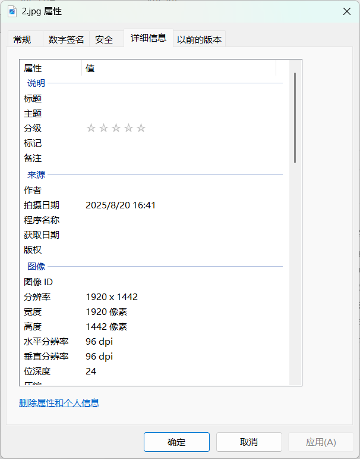
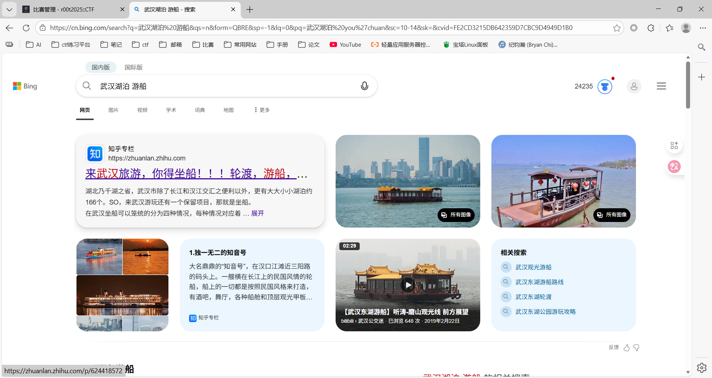
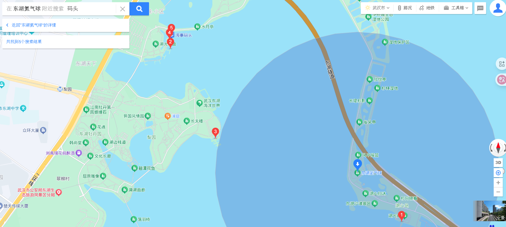
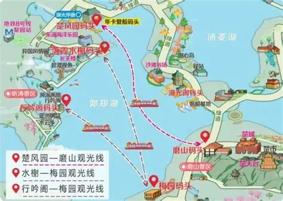
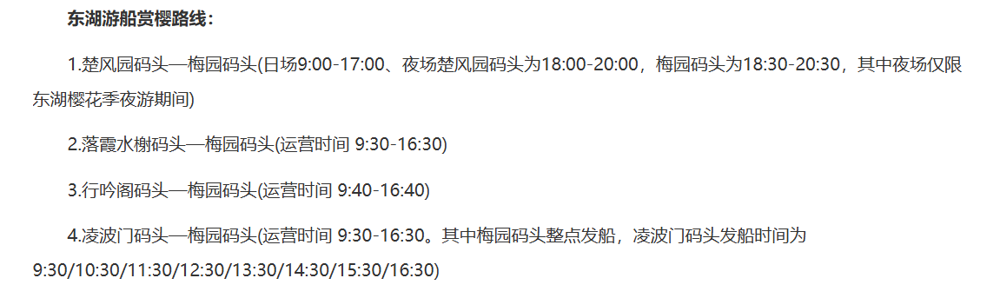

题目描述：见面点只是表象。 新消息传来，是一张在船上拍摄的图片。但这次的附言有所不同： “起点与终点，才是这次旅行的真正门票。” 请分析这张图片，找出船只的起航地与它此程的目的地。

提示：
1. Flag格式：若起点是A码头，终点是B码头，flag为r00t2025{A码头_B码头}
2. 请完成见面地点后再做这道题
3. 避免歧义，新增了一个flag，找到地方的同学可以再试一下

题解：

可以看到拍摄者在一艘船上，应该是在某个湖泊中，提示二暗示了还在武汉

查看图片exif信息得到拍摄时间为2025/8/20 16:41

现在基本就能锁定是东湖了

不难发现，图片右方有个球型建筑，搜索关键字，得知是东湖观光氦气球

尝试一下就可以得到是楚风园码头到磨山码头

其实在出题时~~我把终点记错了~~🫣，当时搜到了价格表（没注意是赏樱路线）

根据时间可以排除只剩第一条路线。

其实锁定了地点10次以内肯定可以得到答案了，没想到很多人都是列出所有的排列组合，一个一个试出来的🫠，看来以后要限制提交次数了😈。
