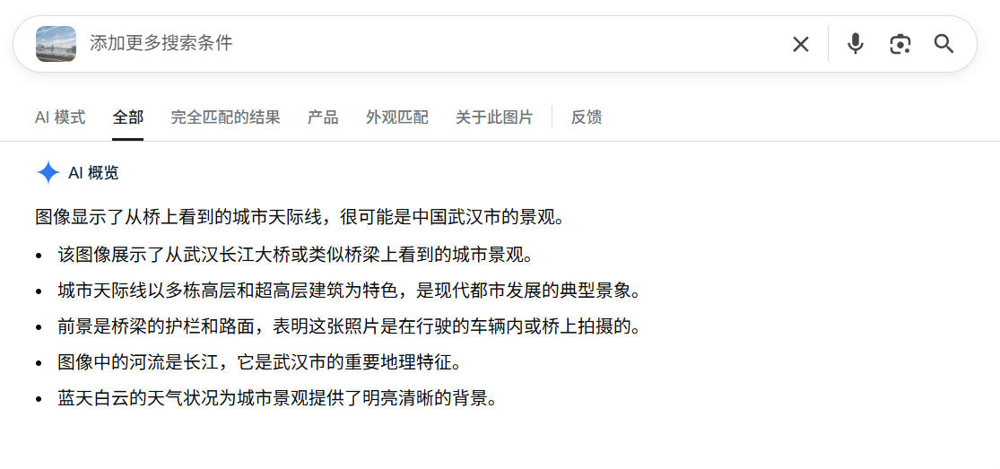

题目描述：毕业散场，高中的微信群日渐冷清。直到那天，LE0的手机突然弹出久违的消息——一张随手拍的图片，配文只有一句：“懂的都懂，老地方集合。” 一场秘密的暑期旅行邀约已发出。你的任务，就是破解这张图片，找到拍摄者的所在地。

提示：Flag格式：若目标地点是“黄埔大桥”，则答案为 r00t2025{黄埔大桥}。

题解：

google识图直接秒了（虽然简单，但没想到做出来的人比签到还多😂）

