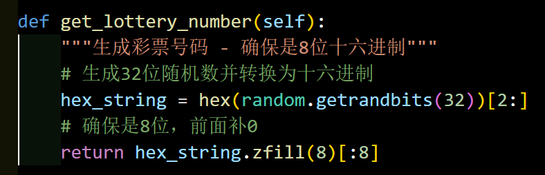

## 博彩系统

### 题目描述

博彩，首先是要学会保证自己的胜率，保证不输，有一个稳定的胜率，在这个前提下研究投资策略和运用投资策略才有作用。（摘自百度百科） 但是，若研究清楚博彩机制，是否可以做到百战百胜呢？这是一场豪赌，桀桀桀。

### 解题思路

这种题目先开个实例操作一下试试手，再去看源码，我觉得理解会更加深刻。

我们发现就是一个赌博模拟器，可以观望开奖，也可以自己参与抽奖，在阅读源码后发现只有在11次机会内成功10次才可以获得flag。

如何获得呢？

发现生成彩票号码的方式采用了random库：

考虑到之前说过的这个伪随机算法使用的是MT19937，通过19968个bit可以恢复随机数状态从而预测伪随机数，恰好，32位随机数就是这一算法所使用的，未经处理的。

所以，我们写脚本收取624轮看到的号码，投入rancrack库中，从而预测出后面的号码，连续10轮，成功得到flag。

写脚本的时候需要注意传递参数的形式。

脚本如下：

```python
from time import sleep
import requests
import json
import randcrack
from flask import jsonify
from tqdm import trange

WEBSITE_BASE = 'http://111.111.111.111:114514/'

# list_32s:list[int] = []
predict = randcrack.RandCrack()
for i in trange(624):
    data = {}
    response = requests.post(WEBSITE_BASE+"api/view-result", data=data)
    return_data = json.loads(response.text)
    winning_number = return_data['winning_number']
    # list_32s.append(int(winning_number,16))
    predict.submit(int(winning_number,16))


session = requests.Session()
i = 11
while True:
    data = {"user_number":hex(predict.predict_getrandbits(32))[2:]}
    a = session.post(WEBSITE_BASE+"api/bet", json=data)
    return_data = json.loads(a.text)
    print(f'{data=}')
    print(a.text)
    if (return_data['is_winner'] == True):
        i-=1
    # print(f'{i=}')
    # print(f'{return_data['tokens']=}')
    assert(return_data['tokens'] == i)
    if (i==1):
        global return_secret
        return_secret = return_data['secret_key']
        break
    sleep(1)

# return_secret=268175942560042035417915799111516424499758280312945119252380132686751559955212637401620619663300265415369900850
from Crypto.Util.number import long_to_bytes
if type(return_secret) == str:
    return_secret = int(return_secret)
m = return_secret^predict.predict_getrandbits(256)
print(long_to_bytes(m))
```

当然，由于未知的网络因素，可能产生收包顺序问题和丢包问题，脚本有时候会执行失败，不过多次执行没啥大问题。

### 出题思路

考察MT19937了解，这也是我在兴趣小组讲过的内容，而且比较基础。