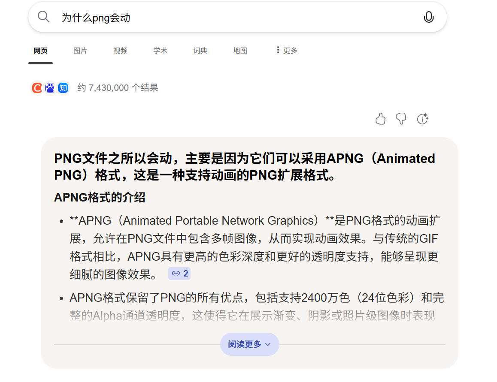
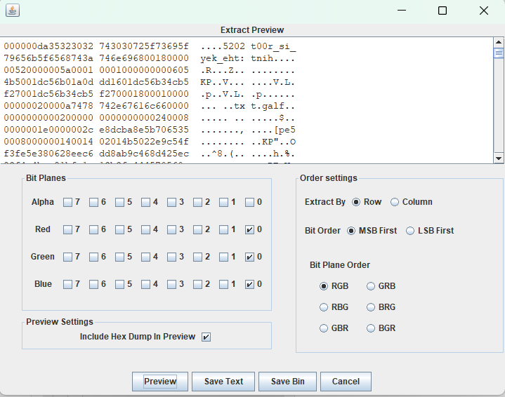
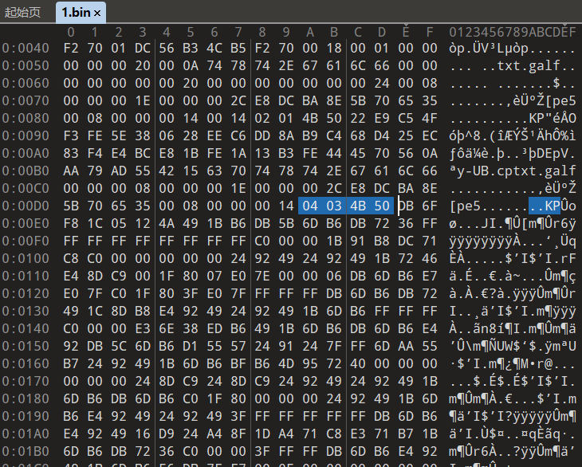
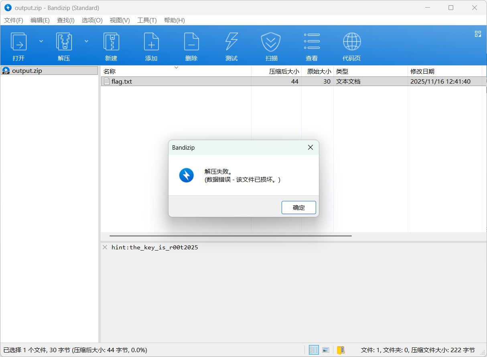
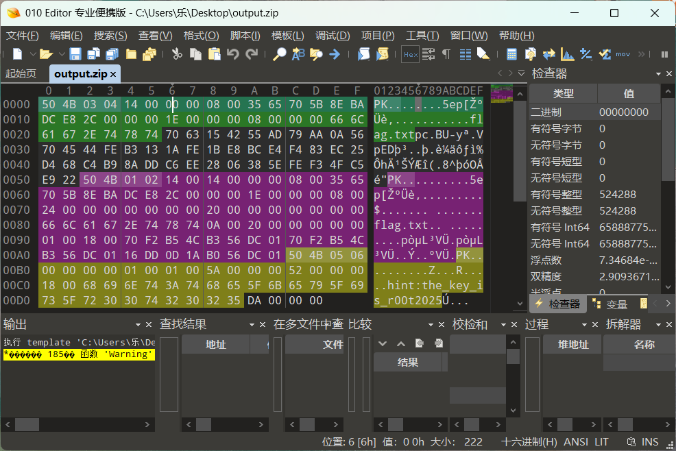
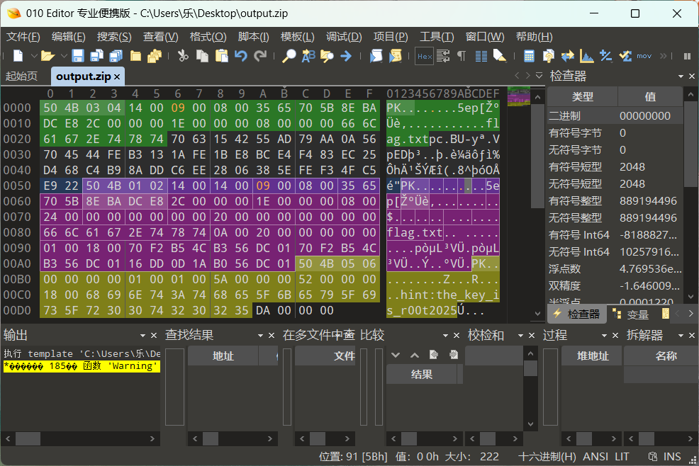
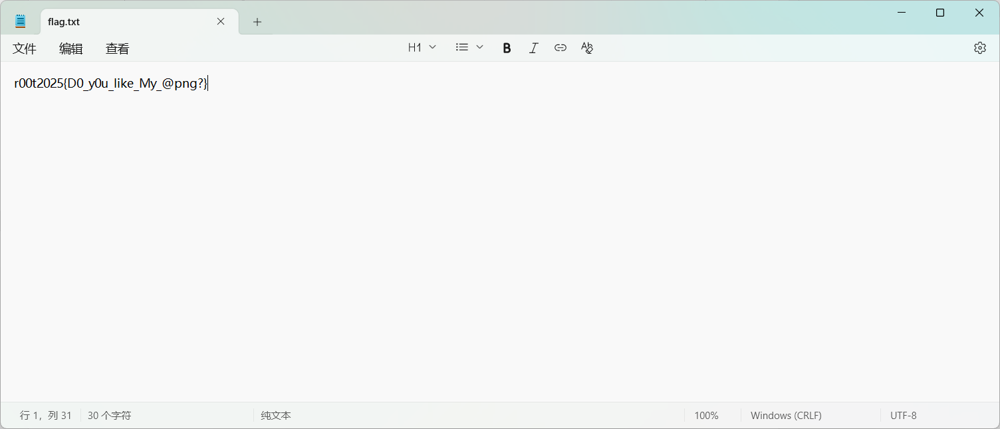

题目描述：是不是我打瓦打多，出现幻觉了，png怎么会动呢？

提示：图片默认从0开始

题解：

提示了png会动，那么去搜一下


所以这张图片是apng，改一下后缀，但是查看apng需要专门的软件，你也可以把png拖到浏览器里查看。

apng类似于gif，是一帧一帧合成的，这里的考点类似于gif的间帧隐写，分解apng，提取每张图片的间隔时间。

时间提取脚本

```python
import struct
def extract_apng_Delay_num(apng_file_path):
    delay_numbers=[]
    try:
            with open(apng_file_path,'rb') as f:
                    f.read(8)
                    while True:
                            length_bytes=f.read(4)
                            if not length_bytes:
                                    break
                            chunk_length=struct.unpack('>I',length_bytes)[0]
                            chunk_type_bytes=f.read(4)
                            chunk_type=chunk_type_bytes.decode('ascii')
                            if chunk_type=='fcTL':
                                    if chunk_length!=26:
                                            print("wrong fctl chunk")
                                            f.read(chunk_length)

                                    else:
                                            chunk_data=f.read(chunk_length)
                                            delay_num=struct.unpack('>H',chunk_data[20:22])[0]
                                            delay_numbers.append(delay_num)
                                    f.read(4)
                            elif chunk_type=='IEND':
                                    break
                            else:
                                    f.read(chunk_length)
                                    f.read(4)
    except FileNotFoundError:
            print(f"file can not found")
            return
    print("extracted delay num")
    print(delay_numbers)
    print("-"*30)
    ascii_result=""
    for num in delay_numbers:
            if 32<=num<=126:
                    ascii_result+=chr(num)
            else:
                    pass
    print(f"ascii decoded:{ascii_result}")
if __name__=="__main__":
    file='taiji.png'
    extract_apng_Delay_num(file)

```

图片拆分可以写脚本也可以用工具APNGDisassembler

找到第39张（一开始没想到有人分解出来是从1开始的，是我考虑不周了😭）

拖到stegslove中查看，发现有lsb隐写



先save bin全部保存,用010打开分析


发现是按照字节倒序的压缩包，ctrl+shift+c复制压缩包的十六进制编码，另存为一个文件

```python
def reverse_hex_bytes(hex_input):
    """
    将十六进制字符串按字节倒序排列
    :param hex_input: 空格分隔的十六进制字符串（如 "00 00 00 DA ..."）
    :return: 倒序后的十六进制字符串（空格分隔）
    """
    # 分割十六进制字符串为字节列表
    byte_list = hex_input.split()
    
    # 过滤空字符串（处理可能的多余空格）
    byte_list = [byte for byte in byte_list if byte.strip()]
    
    # 按字节倒序排列
    reversed_bytes = byte_list[::-1]
    
    # 拼接为空格分隔的字符串
    return ' '.join(reversed_bytes)

# 原始十六进制数据
original_hex = """00 00 00 DA 35 32 30 32 74 30 30 72 5F 73 69 5F
79 65 6B 5F 65 68 74 3A 74 6E 69 68 00 18 00 00
00 52 00 00 00 5A 00 01 00 01 00 00 00 00 06 05
4B 50 01 DC 56 B0 1A 0D DD 16 01 DC 56 B3 4C B5
F2 70 01 DC 56 B3 4C B5 F2 70 00 18 00 01 00 00
00 00 00 20 00 0A 74 78 74 2E 67 61 6C 66 00 00
00 00 00 00 00 20 00 00 00 00 00 00 00 24 00 08
00 00 00 1E 00 00 00 2C E8 DC BA 8E 5B 70 65 35
00 08 00 00 00 14 00 14 02 01 4B 50 22 E9 C5 4F
F3 FE 5E 38 06 28 EE C6 DD 8A B9 C4 68 D4 25 EC
83 F4 E4 BC E8 1B FE 1A 13 B3 FE 44 45 70 56 0A
AA 79 AD 55 42 15 63 70 74 78 74 2E 67 61 6C 66
00 00 00 08 00 00 00 1E 00 00 00 2C E8 DC BA 8E
5B 70 65 35 00 08 00 00 00 14 04 03 4B 50"""

# 执行倒序转换
reversed_hex = reverse_hex_bytes(original_hex)


# 保存为二进制文件（如 ZIP 格式）
with open("output.zip", "wb") as f:
    f.write(bytes.fromhex(reversed_hex))
print("结果已保存到 output.zip 二进制文件")
```

压缩包注释中写了密码，但显示没有密码，并且打不开，说明标记位可能被改了




将数据区和目录区的标记位全改成09，发现有密码了


输入密码r00t2025得到flag


