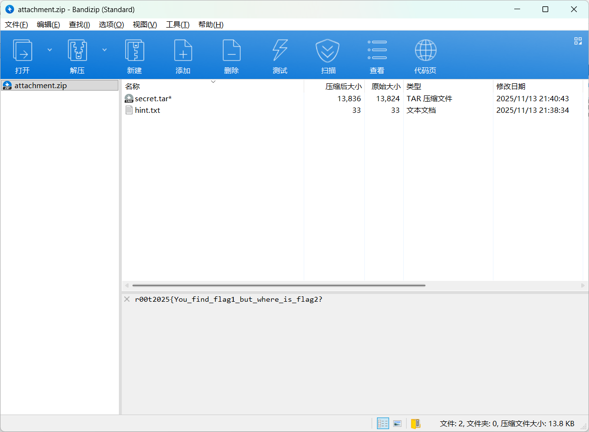
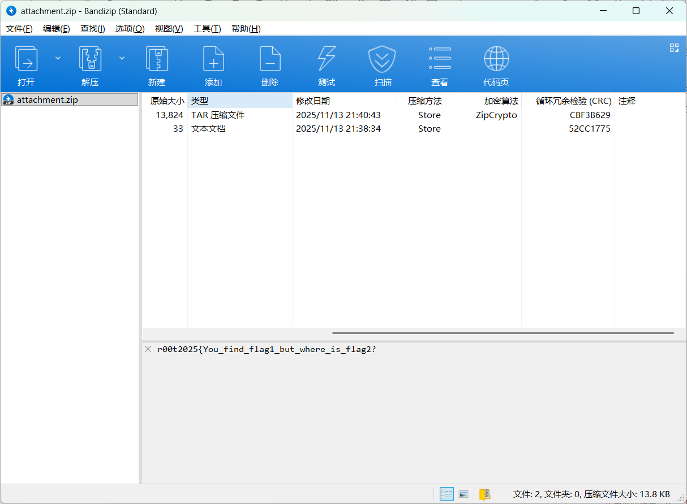
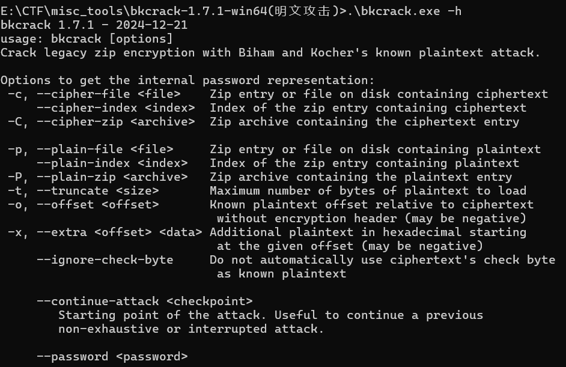
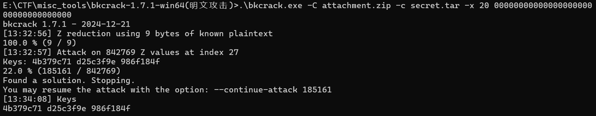
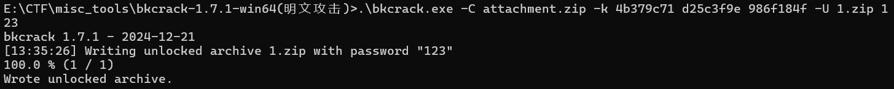
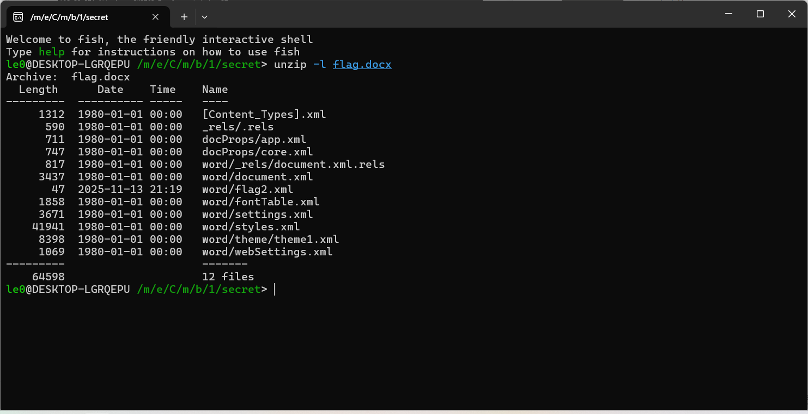
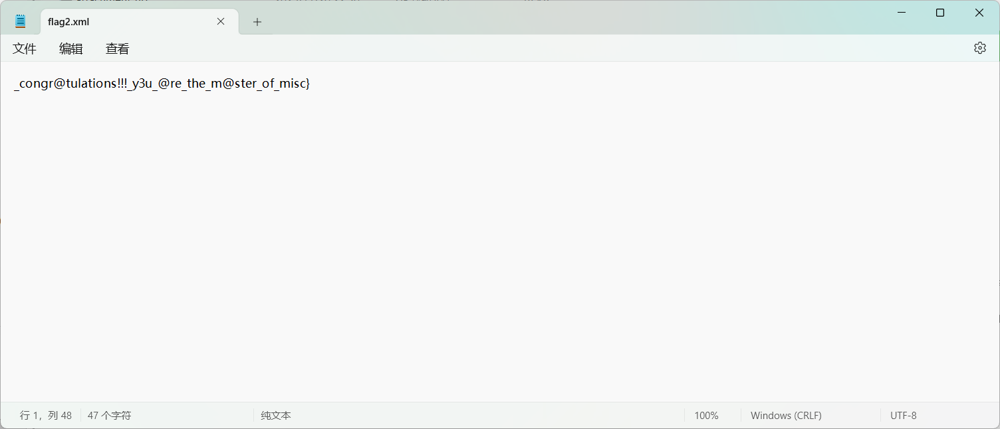

题目描述：奶龙在买夜宵的路上又捡到了一个压缩包，你能发现其中的秘密吗？

提示：可以了解一下tar的文件结构

题解：

拿到压缩包查看注释获得flag1

注意这里的压缩方式为store（仅存储，不压缩），加密算法为Zipcrypto，大概率就是明文攻击了，现在只需要知道16字节以上的明文就可以了。

tar的文件结构详见[TAR - Unix 存档文件格式](https://docs.fileformat.com/zh/compression/tar/)

前100字节存储的是文件名的信息，如果长度不够就补0

那么就很显然了，明文就是文件名后的0（肯定在16字节以上，满足明文攻击的条件），由于不清楚文件名的长度（其实也能猜到是flag.xxx）,偏移量设个20，用bkcrack进行明文攻击

bkcrack的简单用法

> 先 \bkcrack -L 压缩包 ：查看压缩算法是不是"ZipCrypto"，不是的话就不能明文攻击
   然后.\bkcrack.exe -C 压缩包名字 -c 压缩包中你知道一部分内容的文件的文件名 -p 当前目录下你已知的明文文件
   拿到keys之后.\bkcrack -C 压缩包名字 -k 刚才得到的keys -U 新压缩包的名字 新密码

这里还要用到`-x`参数设置偏移量

得到key

生成一个新的压缩包

解压后得到flag.docx，打开发现啥也没有

> 其实docx实际上是一个zip文件，里面存储了包含文档内容的xml文件

用`unzip -l`来查看压缩包包含的文件，发现flag2

解压后用记事本打开flag2.xml得到flag2

