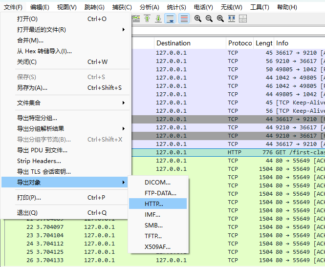
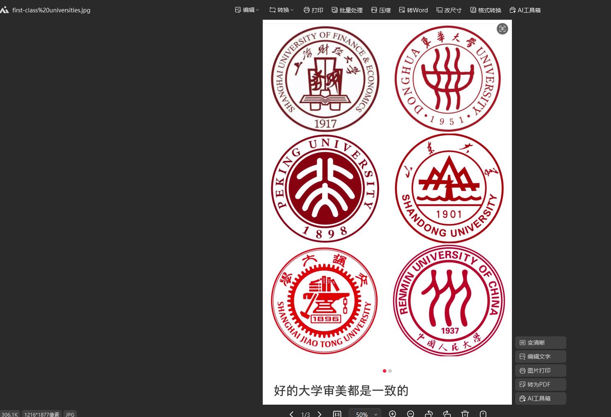
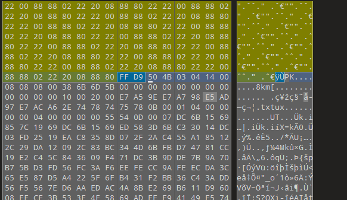
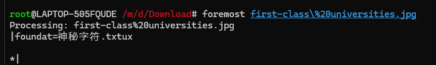
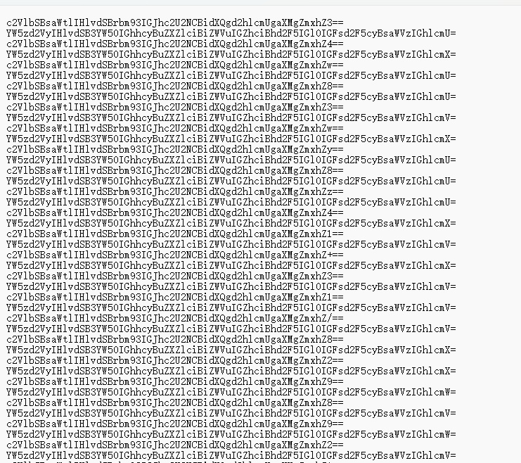
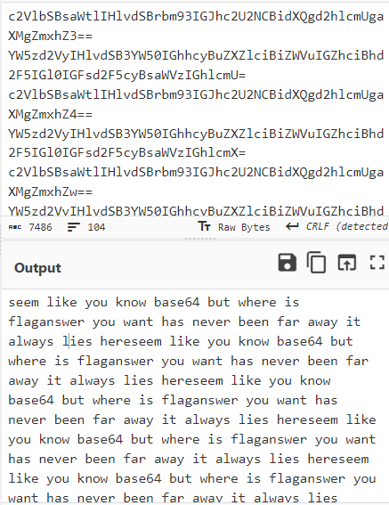
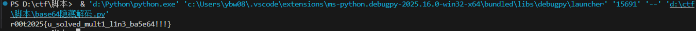

# 神秘的流量

下载流量包后发现很明显的有一条流量中传输了图片


我们可以使用wireshark将其导出





似乎只是一张普通的照片，我们把它拖入010中看看，可以看到在图片末尾出现了pk头，说明实际上这个图片隐藏了一个压缩包，我们使用foremost将其分离出来





解压后得到很长一串base64字符



我们首先先将他们放入cyberchef



可以看到解码后的内容说flag就在文字中，但是怎么得到呢。

这时我们注意观察，发现每行的base64的末尾其实是不相同的，但是他们却能得到同样的解码结果，这是为什么呢。这里就得追溯到base64的原理了。

**Base64的编码原理**

Base64编码的基本原理是将3个字节（24位）的二进制数据转换为4个可打印的ASCII字符。具体步骤如下：

**分组**：将输入数据每3个字节分为一组（24位）。
**拆分**：将这24位拆分为4个6位的块。
**索引**：使用每个6位块作为索引，查找Base64字符表。
**填充**：如果最后一组不足3个字节，则使用填充字符"="补齐。

编码时，每 3 个字节一组，共 8bit*3=24bit，划分成 4 组，即每 6bit 代表一个编码后的索引值，划分如下图所示：


这样可能不太直观，举个例子就容易理解了。比如我们对 `cat` 进行编码：


可以看到 `cat` 编码后变成了 `Y2F0`。

如果待编码内容的字节数不是 3 的整数倍，那需要进行一些额外的处理。

如果最后剩下 1 个字节，那么将补 **4 个 0 位**，编码成 2 个 Base64 字符，然后补两个 `=`：


如果最后剩下 2 个字节，那么将**补 2 个 0 位**，编码成 3 个 Base64 字符，然后补一个 `=`：


可以看到，当我们的待编码字符的二进制位数不为24的整数倍时就会进行补码的操作，而补充的位皆为0，这些补充的位数是不影响我们解码的，所以我们就可以把想要隐藏的内容转换成一个个二进制数藏到这些补充位置上，这样解码时也无法查看到任何异样。但是编码上由于我们隐藏的字符每个之间都有差距，导致编码会有所差异。所以我们可以编写一个脚本，当末尾是一个等号时，说明等号前的字符的低两位是补充位，而当末尾是两个等号时，说明等号前的字符的低四位是补充位，提取出每一行的隐藏二进制数，将他们按照八位分组，再进行二进制解码，即可得到原本的字符

exp

```
d='''
''' #密文放在这里
e=d.splitlines()
binstr="" #得到的加密二进制信息
base64chars = "ABCDEFGHIJKLMNOPQRSTUVWXYZabcdefghijklmnopqrstuvwxyz0123456789+/=" #原始base64表
for i in e:
    if i.find("==")>0:
        temp=bin((base64chars.find(i[-3])&15))[2:] #与运算提取倒数第三位的低四位，bin运算将数字转化为纯二进制，[2:]去除开头的0b
        binstr=binstr + "0"*(4-len(temp))+temp #将隐藏信息补足至四位
    elif i.find("=")>0:
        temp=bin((base64chars.find(i[-2])&3))[2:]
        binstr=binstr + "0"*(2-len(temp))+temp
str_=bytearray() #可以直接通过decode('utf-8')方法转换为字符串。
for i in range(0, len(binstr), 8):
    if i + 8 <= len(binstr):
        index = int(binstr[i:i + 8], 2)  # 每 8 位转换为索引值
        if 0 <= index < 256:  # 确保索引值在有效范围内
            str_.append(index)  # 追加字节数据到 bytearray

print(str_.decode('utf-8'))  
```

