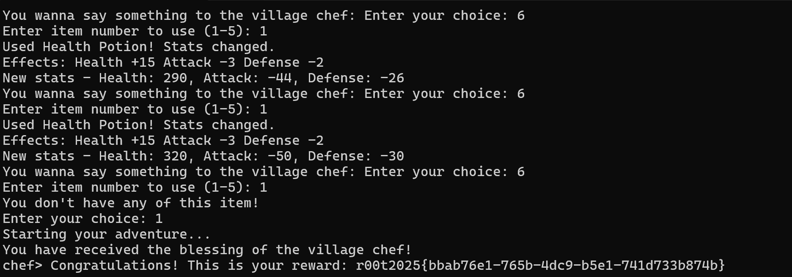

### 九龙拉棺[类固醇之力]

#### 题目描述

通过不懈努力，勇者即刻将飞升类固醇星球。

#### 解题思路

这题我都没兴趣写脚本，直接交互就行——依次输入：`414141414141414161616161616161611`就可以获得flag了。

先理解一下再看原因

这就是一道基础的整数下溢问题啊，正常情况下可以尝试求解方程，没有合适的正整数解。
但是在判断是否是大于内容的时候使用是uint而不是int啊，意味着负数会被视为超级大的整数，远大于比较的内容。
而前面的检测虽然编译器帮我进行了错误的优化，但是也变成了只是检测是否等于0，如果等于则将其置为1。
所以，完全不影响我们整数下溢。

#### 出题思路

我就奇了怪了，这道题明明可以算是pwn中最简单的一种漏洞，当然危害一般也是最小的。

做题的时候，这道题甚至不用写脚本，可以直接交互输入得到flag。

出题的时候，我甚至以为可能会是解数最多的一题，居然没人做出来。是大家逆向水平不太好没看懂程序反汇编代码还是都被栈溢出迷惑了？