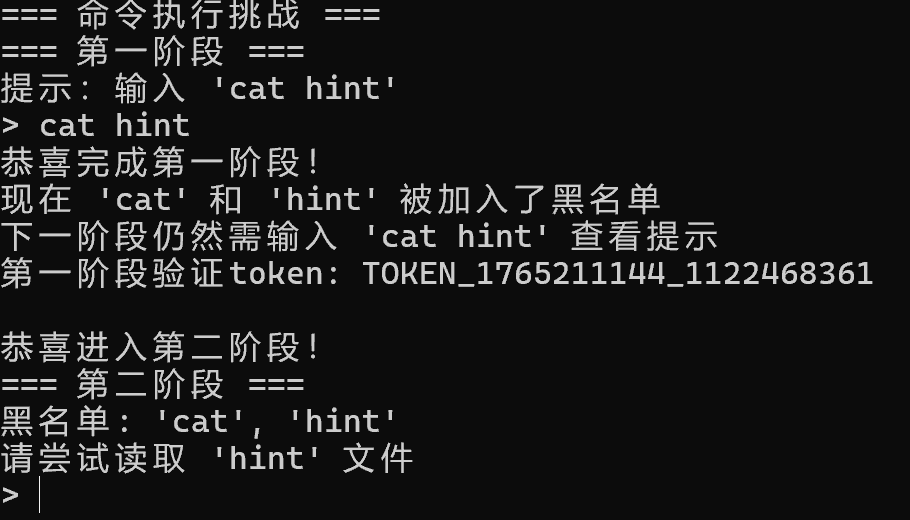
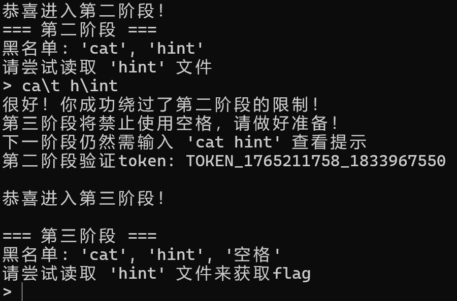
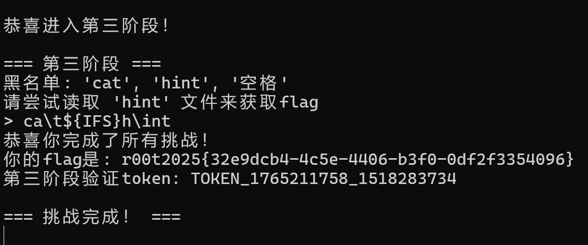
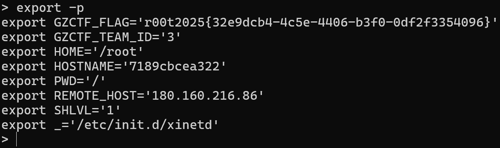

### 名单[黑]

#### 题目描述

就算我让你执行命令，你又能如何呢？我就是让你找不到flag，让你空有权限没法执行命令，急死你ψ(｀∇´)ψ。

#### 解题思路

预期解法是按照提示进行操作：

第一步：输入`cat hint`:

第二步：绕过cat和hint，我们可以通过反斜杠绕过:

第三步：绕过空格，我们可以通过${IFS}绕过:

当然，由于这是帮助大家熟悉操作命令的一题，所以我们可以其他一些非预期解法完成（<del>其实是我在删除环境变量的时候打错名字了😂</del>）：已知获取环境变量就可以得到flag，所以我们可以使用`set`（由于不存在env）：
或者`export -p`：
等等，有许多，在此不一一赘述。

#### 出题思路

让大家熟悉一下linux命令，其实这题正常做不算太pwn，非预期反而更像。

而且由于出题时间比仓促，量也不小，防护并没有做的非常周全，只是ban掉了sh，也可以非常简单的绕过。

总而言之，是一道非常简单的题目。