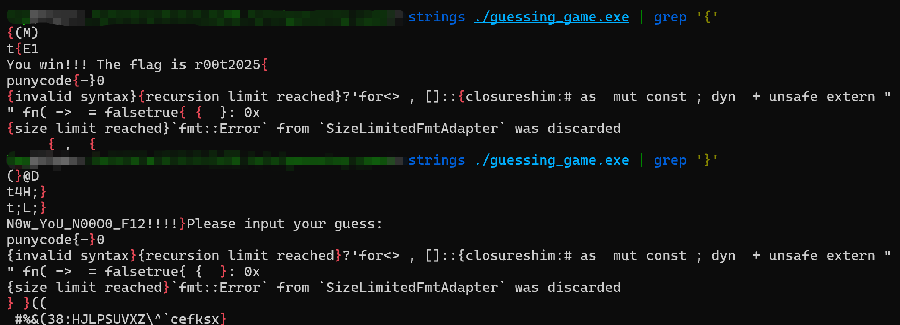

### guessing game

#### 题目描述

看似复杂的事物其实可能非常简单，不过有时候不要太相信自己的视力。

#### 解题思路

放入ida直接开始分析，发现有又臭又长的1000多个函数，还是未命名的。

这个时候不要怕，先 `shift+F12`查看字符串：

定位到一些关键信息：`The flag is r00t2025{`，`Please input your guess!`。

聪明的你可能已经推测出来，flag就是两个字符串的拼接了（我大括号都分别放在两个地方了）：`r00t2025{N0w_YoU_N00O0_F12!!!!}`。

> 顺带一提，题目提示复制的原因是虽然ida看着好像是几个0，但是其实有个o。

如果没看出来也没关系，我们进入程序分析：定位到关键函数：

```c
__int64 sub_140002260()
{
  int v0; // eax
  int v1; // edx
  __int64 v2; // rax
  __int64 v3; // rdx
  __int64 v4; // rax
  __int64 v5; // rdx
  char v7; // [rsp+2Fh] [rbp-51h]
  _BYTE v8[48]; // [rsp+80h] [rbp+0h] BYREF
  _QWORD v9[2]; // [rsp+B0h] [rbp+30h] BYREF
  int v10; // [rsp+C4h] [rbp+44h] BYREF
  __int64 v11; // [rsp+C8h] [rbp+48h] BYREF
  _BYTE v12[12]; // [rsp+D4h] [rbp+54h] BYREF
  _BYTE v13[48]; // [rsp+E0h] [rbp+60h] BYREF
  _BYTE v14[24]; // [rsp+110h] [rbp+90h] BYREF
  __int64 v15; // [rsp+128h] [rbp+A8h] BYREF
  int v16; // [rsp+134h] [rbp+B4h] BYREF
  __int64 v17; // [rsp+138h] [rbp+B8h]
  _BYTE v18[48]; // [rsp+140h] [rbp+C0h] BYREF
  __int128 v19; // [rsp+170h] [rbp+F0h] BYREF
  __int128 v20; // [rsp+180h] [rbp+100h] BYREF
  _BYTE v21[48]; // [rsp+190h] [rbp+110h] BYREF
  __int128 v22; // [rsp+1C0h] [rbp+140h] BYREF
  __int128 v23; // [rsp+1D0h] [rbp+150h] BYREF
  _BYTE v24[48]; // [rsp+1E0h] [rbp+160h] BYREF
  _BYTE v25[48]; // [rsp+210h] [rbp+190h] BYREF
  _BYTE v26[48]; // [rsp+240h] [rbp+1C0h] BYREF
  __int128 v27; // [rsp+270h] [rbp+1F0h] BYREF
  __int128 v28; // [rsp+288h] [rbp+208h] BYREF
  _BYTE v29[48]; // [rsp+298h] [rbp+218h] BYREF
  __int64 v30; // [rsp+2C8h] [rbp+248h]
  int v31; // [rsp+2D4h] [rbp+254h]
  __int64 v32; // [rsp+2D8h] [rbp+258h]

  v32 = -2;
  sub_140009930(v8, &off_140050CE0);            // "Guess the number! Ranging from 1 to 10000.\n"
  sub_14003A130(v8);
  v9[0] = aN0wYouN00o0F12;
  v9[1] = 22;
  while ( 1 )
  {
    while ( 1 )
    {
      v11 = sub_140007810();
      sub_140001350(v12, 1, 10000);
      v10 = sub_1400037B0(&v11, v12);
      sub_140002D60(&v11);
      sub_140009930(v13, &off_140050D20);       // "Please input your guess:\n"
      sub_14003A130(v13);
      sub_140002B60(v14);
      v15 = sub_1400396E0();
      v0 = sub_140039720(&v15, v14);
      sub_140003680(v0, v1, (unsigned int)"Failed to read line!src\\main.rs", 20, (__int64)&off_140050D50);// "src\\main.rs"
      v2 = sub_140002C10(v14);
      v4 = sub_140001410(v2, v3);
      v30 = sub_140001FD0(v4, v5);
      v17 = v30;
      if ( (v30 & 1) == 0 )
        break;
      sub_140002CE0(v14);
    }
    v31 = HIDWORD(v17);
    v16 = HIDWORD(v17);
    sub_1400354A0(&v20, &v16);
    v19 = v20;
    sub_1400345C0(v18, &off_140050D78, &v19);   // "You guessed: "
    sub_14003A130(v18);
    sub_1400354A0(&v23, &v10);
    v22 = v23;
    sub_1400345C0(v21, &off_140050DB0, &v22);   // "The secret number is: "
    sub_14003A130(v21);
    v7 = sub_140002240(&v16, &v10);
    if ( v7 != -1 )
      break;
    sub_140009930(v24, &off_140050DE0);         // "Too small!\n"
    sub_14003A130(v24);
LABEL_9:
    sub_140009930(v29, &off_140050E60);         // "Try again!\n"
    sub_14003A130(v29);
    sub_140002CE0(v14);
  }
  if ( v7 )
  {
    sub_140009930(v25, &off_140050E40);         // "Too big!\n"
    sub_14003A130(v25);
    goto LABEL_9;
  }
  sub_140003860(&v28, v9);
  v27 = v28;
  sub_1400345C0(v26, &off_140050E10, &v27);     // "You win!!! The flag is r00t2025{"
  sub_14003A130(v26);
  return sub_140002CE0(v14);
}
```

可以看到，`You win`开始打印flag，而`off_140050E10`正是后面注释的字符串。同时注意到该函数后面还有一个使用引用的参数：`v27`，向上追踪`v27`是什么：`v27 <- v28 <- v9 <- aN0wYouN00o0F12`，而字符串`aN0wYouN00o0F12`就是`N0w_YoU_N00O0_F12!!!!}`，这总能知道了吧。

而既然我们可以通过直接查询字符串的方式得到这题的flag，我们其实也可以直接用Linux命令strings：

##### 非预期

我是真没想到有人居然直接写脚本运行程序1000多次然后成功的？？？至于吗哥们。。。

#### 出题思路

签到级，考察对于拿到基础逆向题目时候对ida的基础使用，或者其他字符串查询工具也行。

其实这是一个rust程序（可以通过编译器看出来），所以才会显得如此的复杂：

rust逆向题目一般会非常复杂，但是这题并不需要如此复杂的思考。