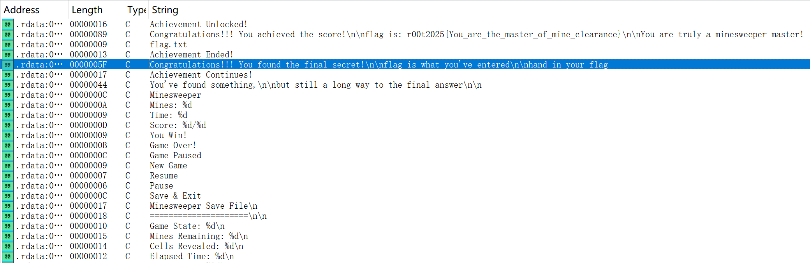
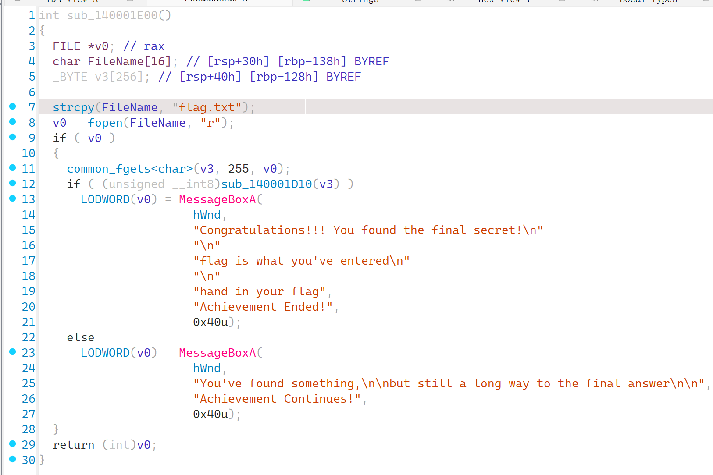
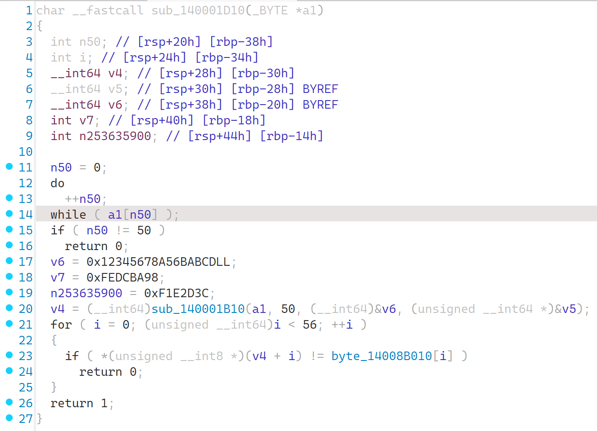
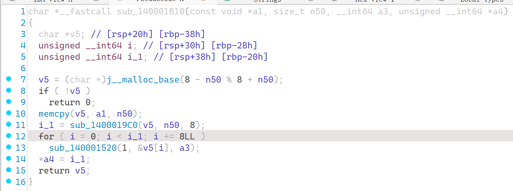

### mine_clearance

#### 题目描述

这次一下游戏都不用玩就可以得到flag哦。

#### 解题思路

这是一个扫雷游戏，但是完全不需要会扫雷，也不需要玩游戏，想拿第一个flag可以玩一玩，也可以不玩。

首先直接die分析完后拖入ida，查看字符串发现许多关键信息：

由于这个题目在预热赛中出过一次，这次不是基础flag了，看到`final secret`，以及`flag is what your've entered`，发现肯定和第一次的flag获取方式不同，就定位该字符串位置：

发现程序打开了同目录下的flag.txt文件进行读取，尝试在自己的同目录下建立该文件，在重新打开该文件的时候，弹出提示框：。这上面显示的文字就是`else`字段`MessageBox`的内容。

猜测判断函数`sub_140001D10`就是将flag转换并比较判断的关键函数，进入该函数：，最终比较的便是`byte_14008B010`，而长度要求可以看出是`50`.

比较的函数还要再里面，是`sub_140001B10()`，传入了共64位的密钥：从这里其实就可以看出来一点端倪，应该是采用了tea加密算法（有每次取8字节为一块，每次加密8块的特征，而之前的密钥空间也符合），`sub_1400019C0`是填充，`sub_140001520`是加密函数本身。进入`sub_140001520`函数看的确如此，甚至还好心的提供了解密函数：a1为正数的时候是加密，为负数的时候是解密。

那么接着就有几种解法了，一种是改变程序，将正和负颠倒，从而让程序运行解密程序。另一种是直接静态分析，这里我们采用静态分析的方法（当然，这种题目直接丢给ai是比较简单的）。

对于分析出来的常见算法，我们最好提前准备好该算法加密和解密的框架，这样直接将数据和密钥套入框架就可以；即使算法经过了魔改，也只需要进行少量修改。

tea算法的魔改版本一般不会改太多内容，否则就不是tea算法而是其基础算法`feistel`了。

本题进行了简单的魔改，而且解密部分也已经列出，只需copy就行。

**解密脚本如下**：

```c
#include <stdio.h>
#include <stdint.h>
#include <string.h>
#include <cstdlib>

// PKCS7填充
size_t pkcs7_pad(uint8_t *data, size_t len, size_t block_size)
{
    size_t pad_len = block_size - (len % block_size);
    for (size_t i = 0; i < pad_len; i++)
    {
        data[len + i] = (uint8_t)pad_len;
    }
    return len + pad_len;
}

// PKCS7去除填充
size_t pkcs7_unpad(uint8_t *data, size_t len)
{
    if (len == 0)
        return 0;

    uint8_t pad_len = data[len - 1];
    if (pad_len > len)
        return len; // 无效填充

    // 验证填充是否正确
    for (size_t i = len - pad_len; i < len; i++)
    {
        if (data[i] != pad_len)
        {
            return len; // 无效填充，返回原始长度
        }
    }

    return len - pad_len;
}

// 解密字符串
uint8_t *tea_decrypt_string(const uint8_t *input, size_t len, uint32_t *key, size_t *out_len)
{
    if (len % 8 != 0)
    {
        // 数据长度必须是8的倍数
        return NULL;
    }

    // 分配内存并复制数据
    uint8_t *decrypted_data = (uint8_t *)malloc(len);
    if (!decrypted_data)
        return NULL;

    memcpy(decrypted_data, input, len);

    // 解密每个8字节块
    for (size_t i = 0; i < len; i += 8)
    {
        modified_tea(-1, (uint32_t *)(decrypted_data + i), key);
    }

    // 去除填充
    size_t unpadded_len = pkcs7_unpad(decrypted_data, len);

    *out_len = unpadded_len;
    return decrypted_data;
}

// 解密
uint8_t *decryption(char *line)
{
    // flag: r00t2025{Th14_is_the_fInO_s3cr3t_0f_mine_clear@n4}
    int len_input = 56;

    uint32_t key[4] = {0xA56BABCD, 0x12345678, 0xFEDCBA98, 0x0F1E2D3C};
    size_t len_output;

    unsigned char *output = tea_decrypt_string((uint8_t *)line, len_input, key, &len_output);

    return output;
}

int main()
{
    char line2[] = {
        177,
        144,
        103,
        147,
        156,
        36,
        63,
        225,
        138,
        57,
        21,
        53,
        156,
        165,
        76,
        202,
        133,
        164,
        82,
        16,
        183,
        11,
        198,
        223,
        253,
        128,
        199,
        9,
        140,
        231,
        141,
        11,
        73,
        177,
        20,
        212,
        112,
        94,
        254,
        105,
        213,
        207,
        121,
        156,
        232,
        132,
        169,
        92,
        170,
        106,
        79,
        46,
        201,
        24,
        27,
        229,
    };
    uint8_t *b = decryption(line2);

    for (int i = 0; i < 56; ++i)
    {
        printf("%c", *(b + i));
    }
}
```

#### 出题思路

依旧是考察ida的基本使用，以及对关键加密函数位置的判断。

初学阶段可以先将代码丢给ai，但理想的学习方式是开启深度思考模式，然后认真阅读ai的思考推理方式，从而养成自己的思维习惯。

希望大家掌握tea算法这一经典算法，增加储备。

拓展了解一下什么是`feistel`算法