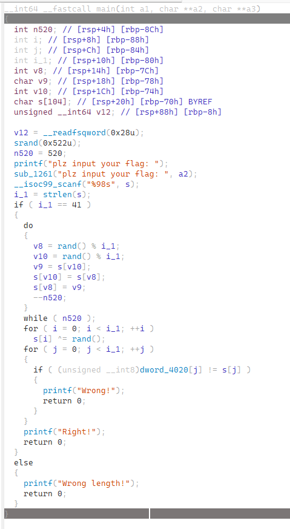
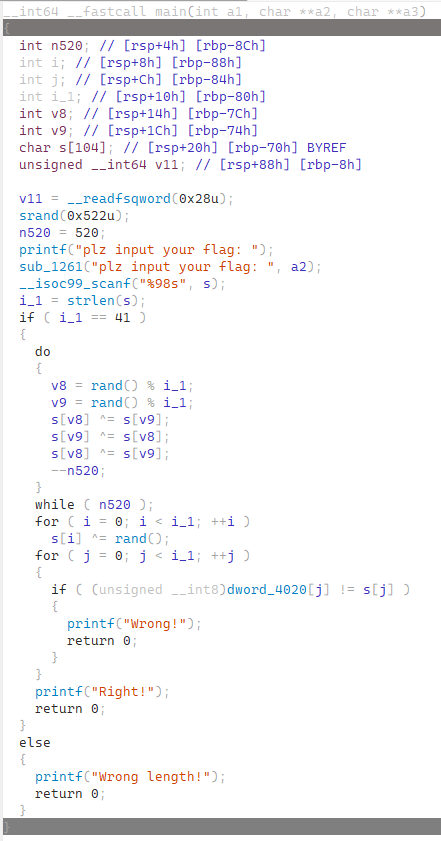
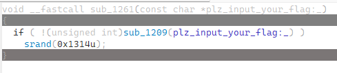
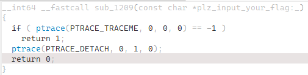

### 固定的随机

#### 题目描述

我们知道计算机的常见随机数都是通过算法实现的，C语言中的rand()使用的是‌线性同余算法，那么：我在一切都正确，种子也找到的情况下为什么得不到正确的答案？
哦，对了，似乎操作系统会影响种子的设置。

#### 解题思路

打开ida，直接用同上方法定位到main函数（也可以直接找到main，用gcc编译的一般情况下会保留main）：xx

> 顺带一提，这是开始的版本，存在一点问题。聪明的你可以和修改版对比一下看看哪里有问题：
>
> 没错，用了不一样的交换方法。那为什么会错呢？
>
> <details>
> <summary>点击显示原因</summary>
> 因为在使用异或进行交换的时候要注意不要出现a=b的情况，这时候两者在异或后都会保持0，而不会达成交换的目的。
> </details>

 那么很明显，我们使用了随机数，并且在开始用了`srand(0x522)`进行设置种子的初始值。

因此，我们可以轻松的先设置种子并按照题目逻辑编写脚本，如下：

```python
import ctypes

libc = ctypes.CDLL("./libc.so.6")

cipher = [21, 132, 224, 132, 118, 130, 196, 190, 19, 244, 240, 119, 28, 106, 165, 191, 123, 76, 115, 235, 74, 212, 42, 44, 41, 89, 103, 130, 41, 239, 79, 177, 186, 164, 15, 226, 247, 105, 57, 183, 74]

length = 41

libc.srand(0x552)

# 记录 swap
swaps = []
for _ in range(520):
    a = libc.rand() % length
    b = libc.rand() % length
    swaps.append((a, b))

# 记录 xor 随机值
xor_values = [(libc.rand() & 0xFF) for _ in range(length)]

# 第一步：逆 xor
res = [(cipher[i] ^ xor_values[i]) & 0xFF for i in range(length)]
print(res)
# 第二步：逆 swap（必须模拟 xor swap）
def xor_swap(arr, i, j):
    arr[i],arr[j] = arr[j],arr[i]

# 逆序执行 swap
for a, b in reversed(swaps):
    xor_swap(res, a, b)

flag = ''.join(chr(c) for c in res)
print("FLAG =", flag)
```

但是为什么还是没法正确恢复flag呢？恢复出来的全是乱码？

这个时候不要因为花了大功夫却没有成功就想放弃了，我们可以再仔细观察一下题目函数逻辑：其中有一点不对劲的地方——有两个`plz input your flag`的字符串，第二个看似是输入，但是下面也有`scanf`，所以没有理由存在啊！

我们进入这个函数看一下：，居然和srand有关，

而上面的函数又是：，可以询问一下ai，这其实是一个检测当前状态是否处于调试的函数，就是说，如果不是调试状态的话，该函数返回非0值，使srand设置为0x1314；否则不修改设置，即为1314（0x552).

那么我们可以更改脚本如下：

```python
import ctypes

libc = ctypes.CDLL("./libc.so.6")

cipher = [21, 132, 224, 132, 118, 130, 196, 190, 19, 244, 240, 119, 28, 106, 165, 191, 123, 76, 115, 235, 74, 212, 42, 44, 41, 89, 103, 130, 41, 239, 79, 177, 186, 164, 15, 226, 247, 105, 57, 183, 74]

length = 41

libc.srand(0x552)

# 记录 swap
swaps = []
for _ in range(520):
    a = libc.rand() % length
    b = libc.rand() % length
    swaps.append((a, b))

# 记录 xor 随机值
xor_values = [(libc.rand() & 0xFF) for _ in range(length)]

# 第一步：逆 xor
res = [(cipher[i] ^ xor_values[i]) & 0xFF for i in range(length)]
print(res)
# 第二步：逆 swap（必须模拟 xor swap）
def xor_swap(arr, i, j):
    arr[i],arr[j] = arr[j],arr[i]

# 逆序执行 swap
for a, b in reversed(swaps):
    xor_swap(res, a, b)

flag = ''.join(chr(c) for c in res)
print("FLAG =", flag)
```

运行，得到`FLAG = r00t2025{zh14_1s_a_t21ck1_@nti_debvgGing}`

#### 出题思路

这题相对之前两题难度上了一个台阶，主要考察了大家的观察是否细致，提醒大家这种题目，每个函数最好还是弄清楚具体什么作用，不要太想当然，同时也考察了一下反调试方面的能力（<del>表达了出题人的思乡之情</del>）。

其实，还有一种直觉解题法（或者说经验解题法），就是当发现解题思路完全正确，脚本编写正确，但是却无法得到正确flag，甚至一个字节都无法恢复的时候，直接可以想到，这题考察随机数，大概是随机数的生成出现问题了，然后去查找srand的交叉引用，会发现有两处调用了srand，由此也可以解出flag。