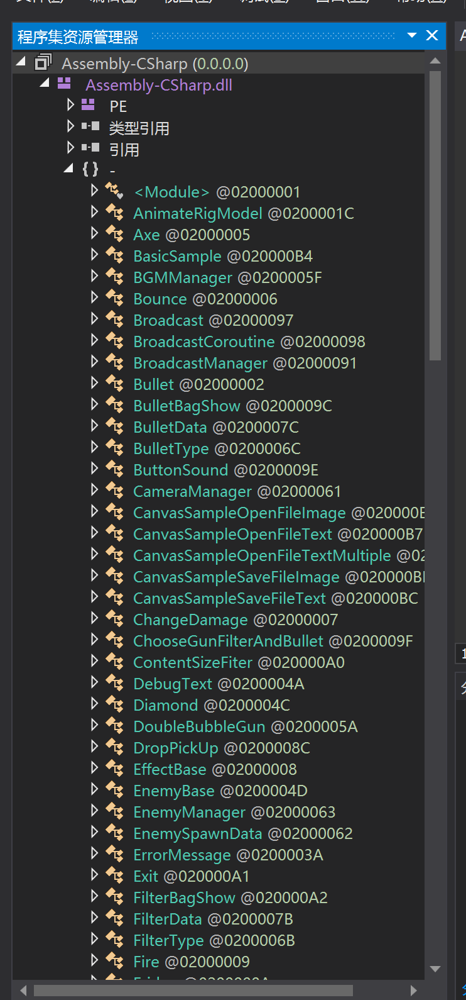
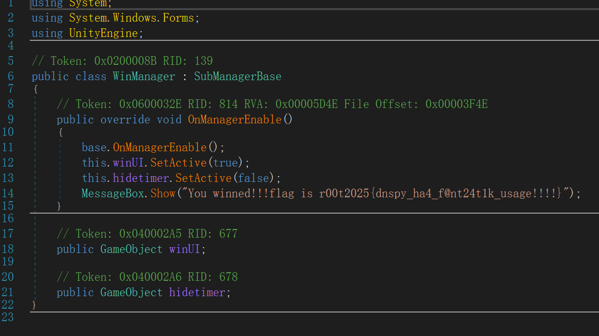

### 土豆兄弟3D

#### 题目描述

土豆兄弟挺好玩的，就是太简单了——Roguelike就是这样，一不小心就凑齐神装无敌了。不过，如果我把它变成3D版本再冻结你的资金，这样是不是有挑战性多了*^____^*。

#### 解题思路

##### 方案一：

玩游戏。不过在肉鸽没有金币全靠身法的前提下，真的有人可以打游戏打通关嘛？我持怀疑态度。

##### 方案二：

逆向。我们直接搜索unity逆向，发现大多数都提到了dnspy这个软件，这是开源的，GitHub上就有，所以不要问我为什么没有讲，没有给安装包文件。

根据搜索到的方法，先查看该游戏文件，发现是`MonoBleedingEdge`文件，是Mono打包而不是烦人的il2cpp，所以找到 `游戏名_DATA/Managed/Assembly-CSharp.dll`，将其拖入`dnspy`即可。

稍微懂点英语就应该知道每个类大概是什么作用了，然后直接看到一个WinManager，里面就是flag。

#### 出题思路

想出点游戏让大家做的不是那么枯燥乏味，但是又怕游戏出太简单了没人用逆向的方法，策划真难做啊`(bushi`。

这只是dnspy最为粗浅的应用，C#之类的程序在除了Unity游戏之外也有挺广泛应用的，包括但不限于病毒程序（前两天就做到一题高危病毒）

关键点就是通过每个函数的定义去猜测他的作用，再通过分析和查看具体了解（当然，如果被混淆了又是另外的说法）。