### 金蝉脱壳

#### 题目描述

我很肯定这是一个upx的壳，毋庸置疑，die也可以告诉你这一点，可就是为什么解不开？？？难不成需要我用手把这个壳掰开w(ﾟДﾟ)w！？？
tips：想要挑战徒手的同学可以尝试用x96dbg，不必拘泥于ida。

#### 解题思路

首先我这个提示比较隐晦的点出了也有不是手动脱壳的方法。回想一下我在逆向课上讲过的upx壳相关的知识，首先大家尝试使用`upx -d task.exe`进行脱壳，会发现爆出错误：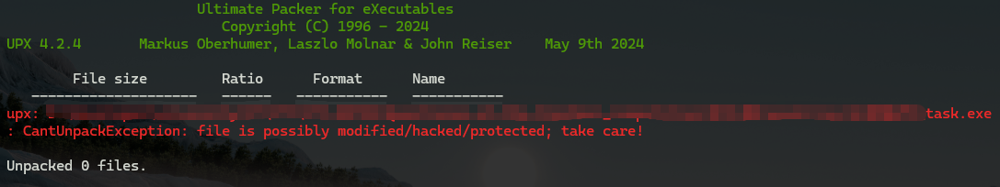

去网上查一下发现，会发现有很多这种情况，都是在源文件上动了手脚影响脱壳，那么最常见的就是修改三个标志位`UPX`。我们使用010打开看一下：

发现只有一个UPX了。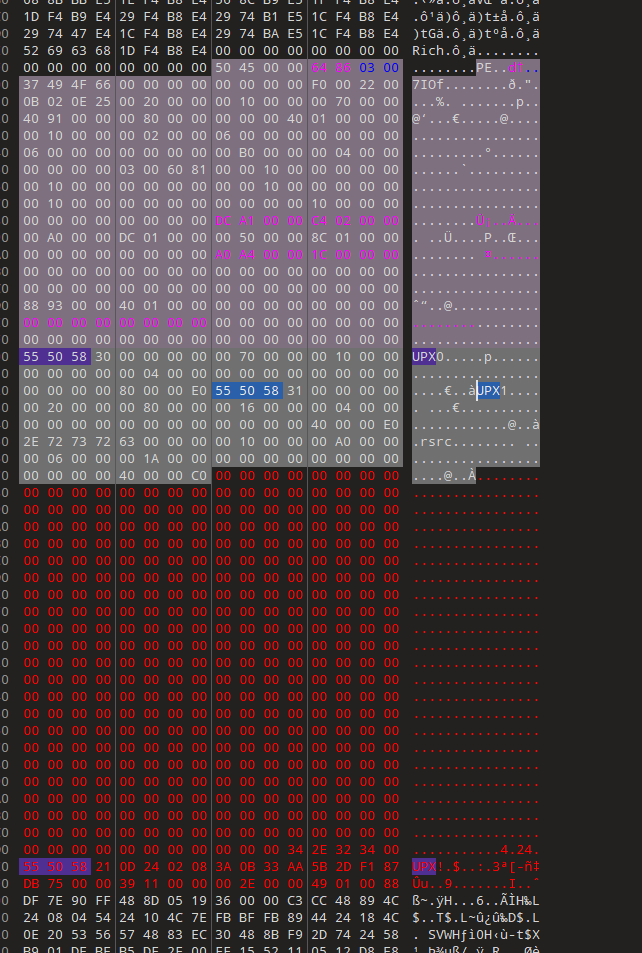

而再自己写一个简单的程序，使用upx加密，可以看到是如上图所示。

这时候我们可以较为清楚的发现在UPX0，UPX1相同的位置上，存在`2E2E2E2E`的样式，我们猜测这就是UPX标志位被修改后的情况。
同时，又注意到在这一部分，UPX!之上存在三个部分有`2E`样式，猜测分别是`UPX0`, `UPX1`, `UPX2`。将其修改后保存，然后重新脱壳，发现成功脱壳，可以继续我们的正常逆向工程了。


然后在开始下一部分的逆向之前，我们先讲讲另一种方法：手动脱壳。

这里我们采用x64dbg进行脱壳。

使用x64dbg打开：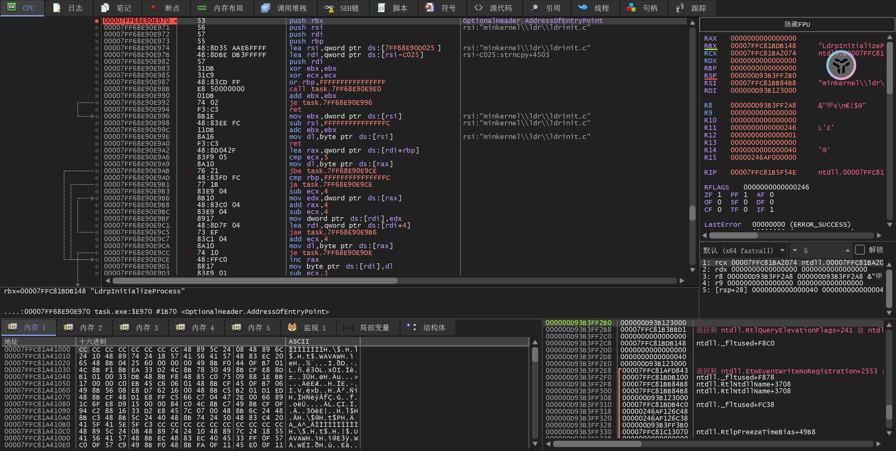

打开断点窗口，双击入口断点：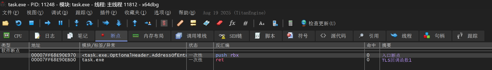

直接在代码中翻找到和入口处断点位置入栈部分相似的出栈部分，并下硬件断点（其实我这里没恢复全，但是够用就行）：
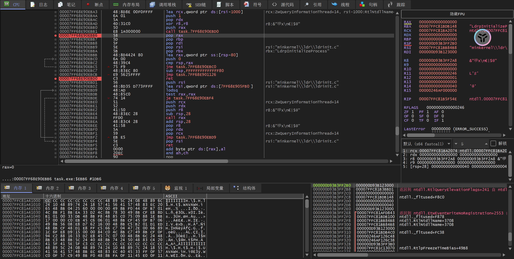

运行至断点处：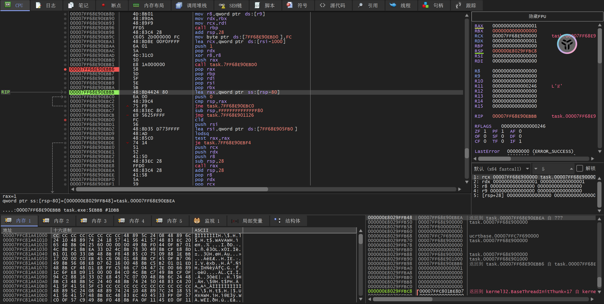

打开scylla（菜单栏中间）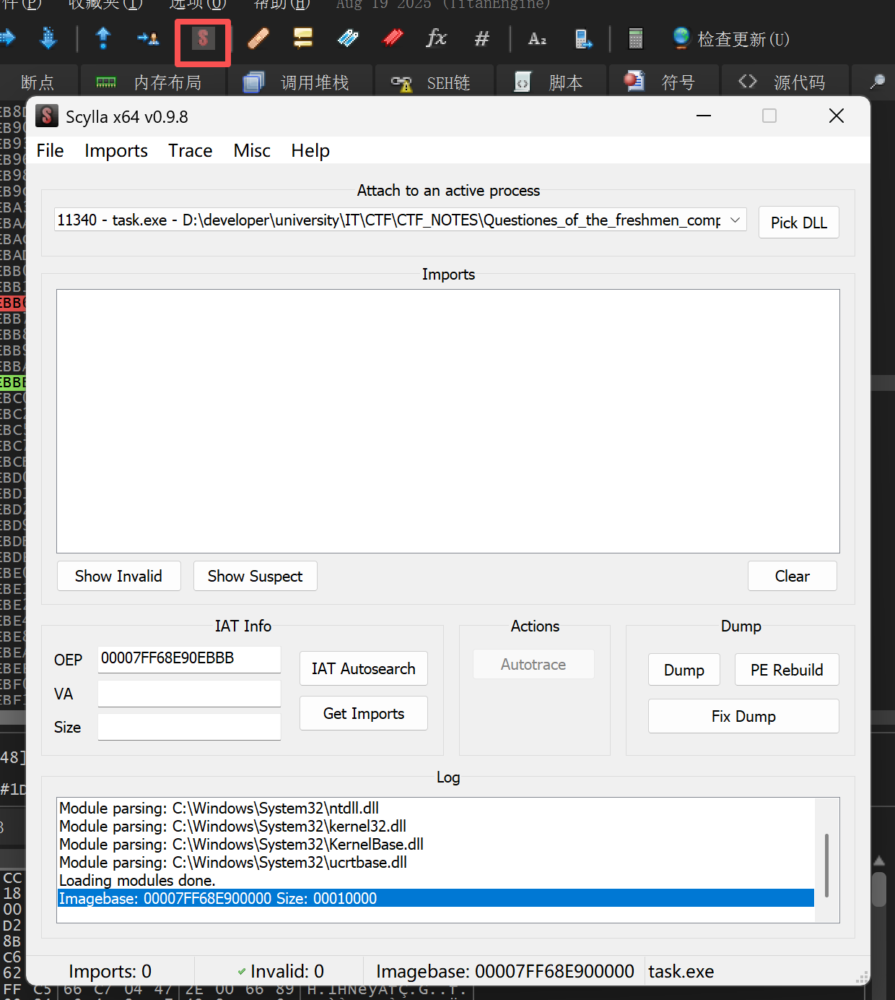

依次选择`IAT Autosearch`，`Get Imports`：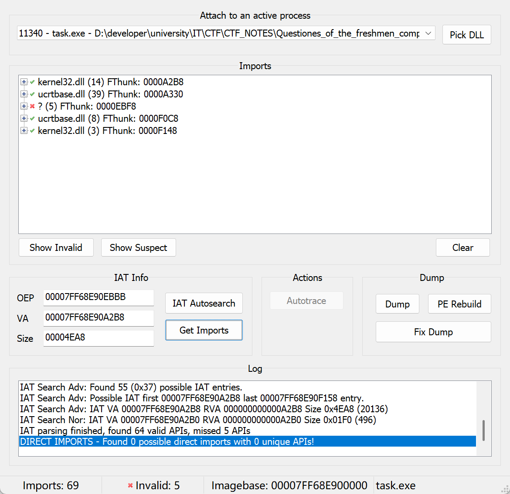

删除红色块（右键`Delete tree node` ）然后Dump，并且修复（fix）：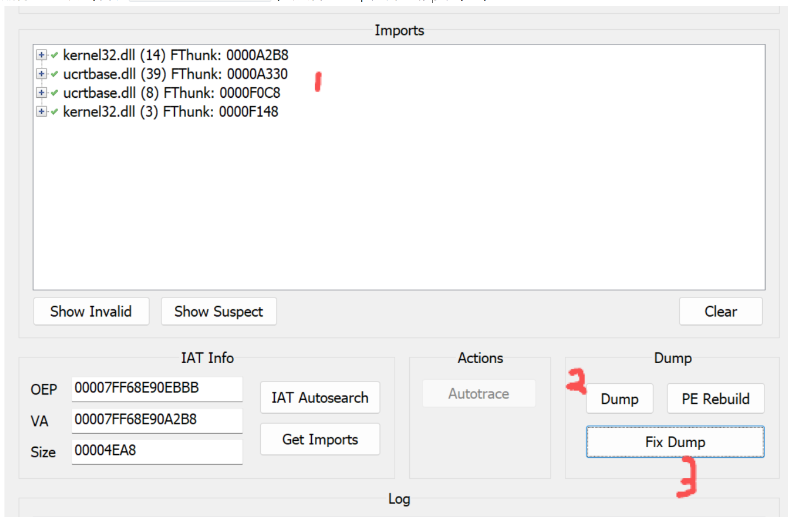

用ida打开生成的文件进行静态分析，发现恢复了部分函数，已经可以分析了：

找到对应的函数开始分析：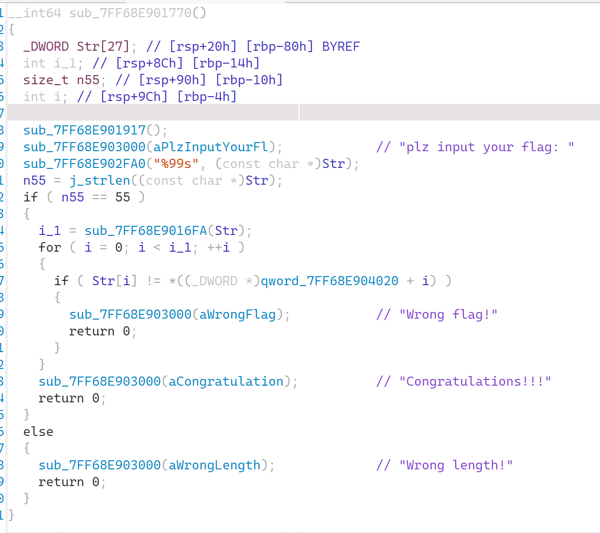

字符长度55，加密函数：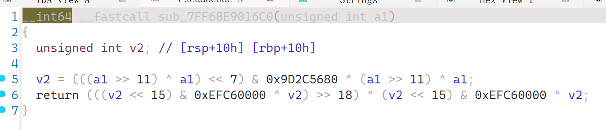

翻译一下：

```python
def encode(y):
    y = y ^ (y >> 11)
    y = y ^ ((y << 7) & 0x9d2c5680)
    y = y ^ ((y << 15) & 0xefc60000)
    y = y ^ (y >> 18)
    return y & 0xFFFFFFFF
```

其实就是python伪随机数MT19937提取随机数的部分。

逆向代码：

```python
def decode(x):
    # 逆向最后一步: x = y ^ (y >> 18)
    # 等价于: y = x ^ (y >> 18)
    # 由于y的高18位与x的高18位相同，我们可以逐步恢复
    x = x ^ (x >> 18)
    
    # 逆向第三步: x = y ^ ((y << 15) & 0xefc60000)
    # 等价于: y = x ^ ((y << 15) & 0xefc60000)
    # 由于低15位不受影响，我们可以从低到高逐步恢复
    x = x ^ (((x&0x7fff) << 15) & 0xefc60000)
    x = x ^ (((x&0xf8000) << 15) & 0xefc60000)
    
    # 逆向第二步: x = y ^ ((y << 7) & 0x9d2c5680)
    # 等价于: y = x ^ ((y << 7) & 0x9d2c5680)
    # 同样从低到高逐步恢复
    x = x ^ (((x&0x7f) << 7) & 0x9d2c5680)
    x = x ^ (((x&0x3f80) << 7) & 0x9d2c5680)
    x = x ^ (((x&0x1fc000) << 7) & 0x9d2c5680)
    x = x ^ (((x&0xfe00000) << 7) & 0x9d2c5680)
    
    # 逆向第一步: x = y ^ (y >> 11)
    # 等价于: y = x ^ (y >> 11)
    # 由于高11位与x的高11位相同，我们可以从高到低逐步恢复
    x = x ^ (x >> 11)
    x = x ^ (x >> 22)
    
    return x & 0xFFFFFFFF  # 确保结果是32位无符号整数
```

于是，最终解题思路：

```python
def decode(x):
    # 逆向最后一步: x = y ^ (y >> 18)
    # 等价于: y = x ^ (y >> 18)
    # 由于y的高18位与x的高18位相同，我们可以逐步恢复
    x = x ^ (x >> 18)
    
    # 逆向第三步: x = y ^ ((y << 15) & 0xefc60000)
    # 等价于: y = x ^ ((y << 15) & 0xefc60000)
    # 由于低15位不受影响，我们可以从低到高逐步恢复
    x = x ^ (((x&0x7fff) << 15) & 0xefc60000)
    x = x ^ (((x&0xf8000) << 15) & 0xefc60000)
    
    # 逆向第二步: x = y ^ ((y << 7) & 0x9d2c5680)
    # 等价于: y = x ^ ((y << 7) & 0x9d2c5680)
    # 同样从低到高逐步恢复
    x = x ^ (((x&0x7f) << 7) & 0x9d2c5680)
    x = x ^ (((x&0x3f80) << 7) & 0x9d2c5680)
    x = x ^ (((x&0x1fc000) << 7) & 0x9d2c5680)
    x = x ^ (((x&0xfe00000) << 7) & 0x9d2c5680)
    
    # 逆向第一步: x = y ^ (y >> 11)
    # 等价于: y = x ^ (y >> 11)
    # 由于高11位与x的高11位相同，我们可以从高到低逐步恢复
    x = x ^ (x >> 11)
    x = x ^ (x >> 22)
    
    return x & 0xFFFFFFFF  # 确保结果是32位无符号整数

def encode(y):
    y = y ^ (y >> 11)
    y = y ^ ((y << 7) & 0x9d2c5680)
    y = y ^ ((y << 15) & 0xefc60000)
    y = y ^ (y >> 18)
    return y & 0xFFFFFFFF


if __name__ == "__main__":
    test_values = [724872889, 4013866939, 1789407613, 120111992, 3228524122, 420539543, 2781594220, 740814239, 2153529584, 2324869627, 26707732, 62622485, 4201518723, 2446794600]
    
    for val in test_values:
        decoded = decode(val)
        string = hex(decoded)[2:].zfill(8)
        chr1 = string[0:2]
        chr2 = string[2:4]
        chr3 = string[4:6]
        chr4 = string[6:8]
        print(chr(int(chr4,16)),end='')
        print(chr(int(chr3,16)),end='')
        print(chr(int(chr2,16)),end='')
        print(chr(int(chr1,16)),end='')
```

#### 出题思路

第一步考察的是upx壳相关的知识。这种壳可以说是已经被用烂了，但是作为入门刚刚好。其多个标志位被篡改是常见考点，如果没法恢复原样，那么手动脱壳更是一个不错的选择。

第二步考察逆向的思路和能力，我们在解题的时候最好将可拆分步骤拆分到最简单的形式，然后再做，这样会方便许多。同时，要知道异或是可逆的（除非和自己——上一题的教训😭），自己和偏移一定位数的自己异或也是可逆的，方法就是逐比特地恢复。