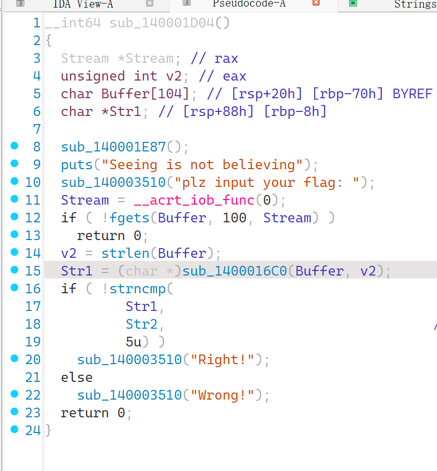
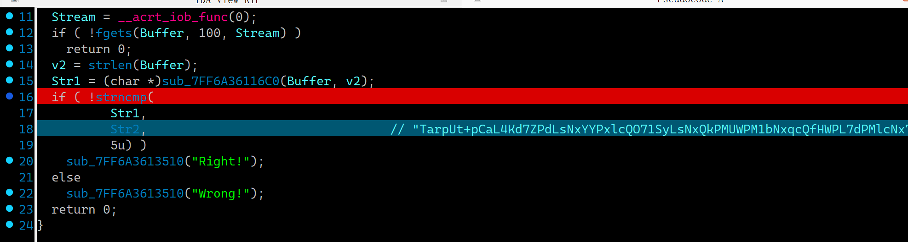
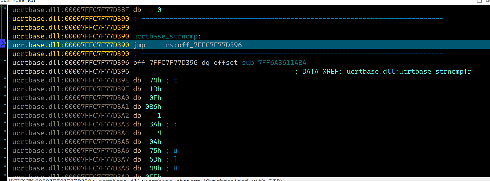
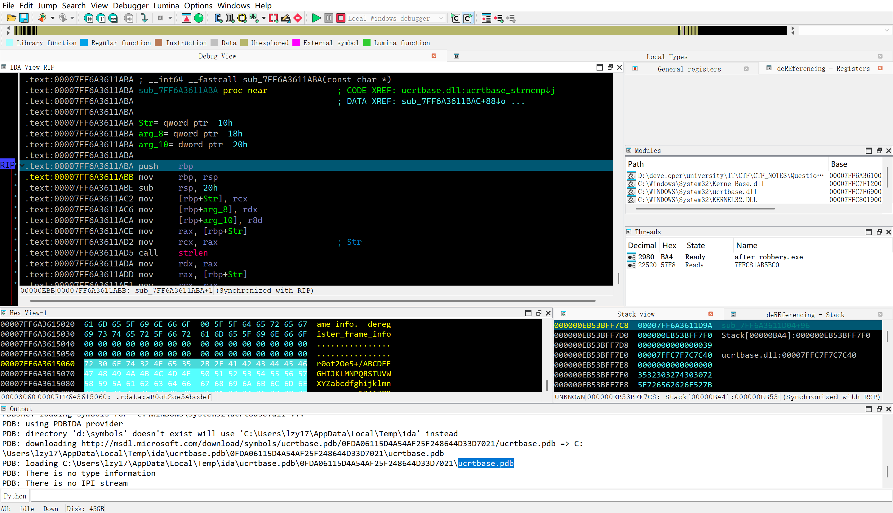
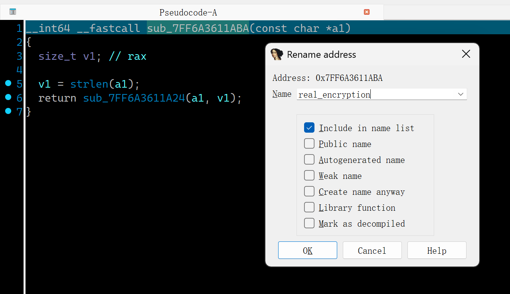
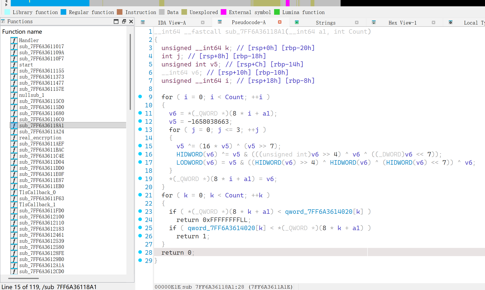
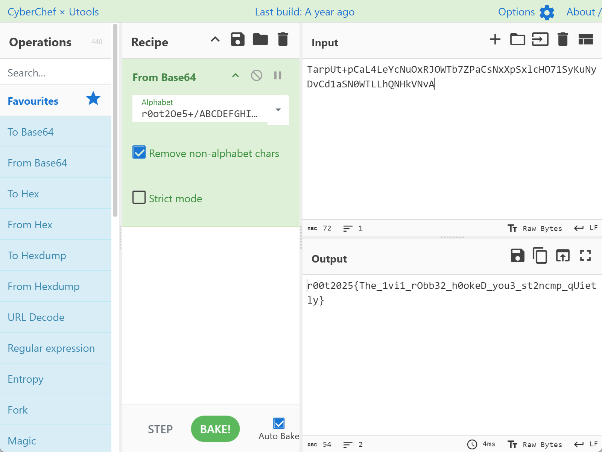

### 无声的强盗

#### 题目描述

基德用他的命运之钩，悄无声息取走了你的flag，同时留下了他来过的痕迹。

#### 解题思路

ida打开程序直接分析，定位到主要函数：

发现加密内容函数`sub_1400016C0`，分析得知是base64编码而不是加密（在最后有点小细节和传统的会有差别，不过并无所谓）使用的替换表是：`r0ot2Oe5+/ABCDEFGHIJKLMNPQRSTUVWXYZabcdfghijklmnpqsuvwxyz1346789=`。最后和` TarpUt+pCaL4Kd7ZPdLsNxYYPxlcQO71SyLsNxQkPMUWPM1bNxqcQfHWPL7dPMlcNx7mQI2Y+Nv=`部分进行比较，发现是`r00t2025{Robber_hacked_your_flag_and_left_a_fake_one!!!}`，将这个flag提交就完成这道题啦！

才怪。交上去发现是错误的，死活看来看去不知道问题，自己运行一下到str1生成结束发现比较部分有一个字节的区别（我的，我的）就僵在那里了。

其实这个flag都说了是`fake one`了，当然就是错了。

还有就是都动态调试到str1生成了，那你再往下动态调试一步又能怎么样呢？

我们运行到这个地方，再向下步进一次（最好不要使用源代码级别的动态调试，就在汇编代码`call strncmp`的地方打断点）：

这个时候会出现下载多少多少byte的情况，这是正常的，因为这个调用了`ucrtbase.dll`，是会出现这样情况的。那么显示如下

再接着步进一步，你会发现一个神奇的事情：我们又回到原程序了！

反汇编成伪C代码，再给这个函数进行一个重命名，方便我们过会儿找到：

终止动态调试，定位到刚刚命名的`real_encryption`，进入查看关键函数部分：

发现类似tea加密，不过有所区别，这里是真正的feistel密码了，解题方式和tea是如出一辙的。

解题脚本如下：

```python
def decrypt_buffer(encrypted_buffer):
    """
    解密经过加密算法处理的数据
    
    Args:
        encrypted_buffer: 加密后的64位整数列表
    
    Returns:
        解密后的64位整数列表
    """
    # 预计算key序列
    KEY_TIMES = 4

    keys = precompute_keys(KEY_TIMES)
    reverse_keys = keys[::-1]
    
    decrypted = []
    for enc_value in encrypted_buffer:
        # 分离高32位和低32位
        highPart = (enc_value >> 32) & 0xFFFFFFFF
        lowPart = enc_value & 0xFFFFFFFF
        
        # 反向迭代
        for j in range(KEY_TIMES):
            key = reverse_keys[j]
            
            # 反向计算步骤
            # 注意：在反向过程中，我们需要先恢复low_part，再恢复high_part
            lowPart ^= (highPart ^ (highPart << 7) ^ (highPart >> 4)) & key
            highPart ^= (lowPart ^ (lowPart << 7) ^ (lowPart >> 4)) & key
        
        # 组合回64位整数
        decrypted_value = ((highPart & 0xFFFFFFFF) << 32) | ((lowPart & 0xFFFFFFFF))
        decrypted.append(decrypted_value)
    
    return decrypted

def precompute_keys(rounds):
    """
    预计算key序列
    
    Args:
        rounds: 迭代轮数
    
    Returns:
        key序列列表
    """
    keys = []
    key = 2636928633  # 初始key
    
    for _ in range(rounds):
        # key更新函数：key = key ^ (key >> 7) ^ (key << 4)
        key = (key ^ (key >> 7) ^ ((key << 4) & 0xFFFFFFFF)) & 0xFFFFFFFF
        keys.append(key)
    
    return keys

def encrypt_buffer(original_buffer):
    """
    加密函数（用于验证解密是否正确）
    
    Args:
        original_buffer: 原始64位整数列表
    
    Returns:
        加密后的64位整数列表
    """
    encrypted = []
    for value in original_buffer:
        high_part = (value >> 32) & 0xFFFFFFFF
        low_part = value & 0xFFFFFFFF
        key = 2636928633
        
        for j in range(100):
            # 计算f函数：f(L) = L ^ (L << 7) ^ (L >> 4)
            f_low = (low_part ^ ((low_part << 7) & 0xFFFFFFFF) ^ (low_part >> 4)) & 0xFFFFFFFF
            
            # 更新high_part
            high_part ^= (f_low & key)
            
            # 计算g函数：g(H) = H ^ (H << 7) ^ (H >> 4)
            g_high = (high_part ^ ((high_part << 7) & 0xFFFFFFFF) ^ (high_part >> 4)) & 0xFFFFFFFF
            
            # 更新low_part
            low_part ^= (g_high & key)
            
            # 更新key
            key = (key ^ (key >> 7) ^ ((key << 4) & 0xFFFFFFFF)) & 0xFFFFFFFF
        
        encrypted_value = ((high_part & 0xFFFFFFFF) << 32) | (low_part & 0xFFFFFFFF)
        encrypted.append(encrypted_value)
    
    return encrypted

# 使用示例
if __name__ == "__main__":
    from Crypto.Util.number import long_to_bytes
    encrypted_data = [0xfa18419c82105cd0, 0x8383627f72413c5, 0x7f8e7a93544c10a1, 0xe9031350a8540835, 0x312f33535afa48ac, 0x82a8301172fe1d8e, 0xbe392caa59e45f6b, 0xaa2629ffe1bb0ef0, 0x876638dd9d081cd2]
    
    decrypted_data = decrypt_buffer(encrypted_data)
    for i in decrypted_data:
        print(''.join(list(long_to_bytes(i).decode())[::-1]),end='')
    print("\n解密后的数据:", decrypted_data)
```

运行解密脚本后，做得头晕转向可能就会在疑惑：这不对啊，我的flag格式那里去了？这解出来的是啥啊，是不是我解错了？

不要急，我们在进入这个部分之前不是先进行了一次base64编码，我们解出来的便是base64编码，将其重新解码一下就能得到答案啦：

#### 出题思路

这题出的有点小细节没有搞清：我自己写的base64算法在末位计算的时候有点小问题，会导致计算得到的fake_flag与比较的fake_flag的base64直接产生一点小区别，其实这个区别是产生base64隐写的小区分，感兴趣的可以看下misc的神秘的流量，那道题目最后一步就是关于这个的小技巧。

本题考察的是动态调试的能力，能否熟练掌握步进和步过来调试程序，寻找不对劲的地方。

其实本题使用的是一个叫做inline hook的技巧，命运之钩也是在暗示这一点，不过这个暗示属于是懂得都懂，不懂的想死系列，也没指望大家悟出来。这个技巧一般在自己去hook一些程序函数比较常用。操作方式就是在进入目标函数后，将第一句的汇编代码改成jmp，跳转到你希望去的地方，最后结束的时候再跳转到目标函数返回处的rip，从而保持堆栈的平衡。