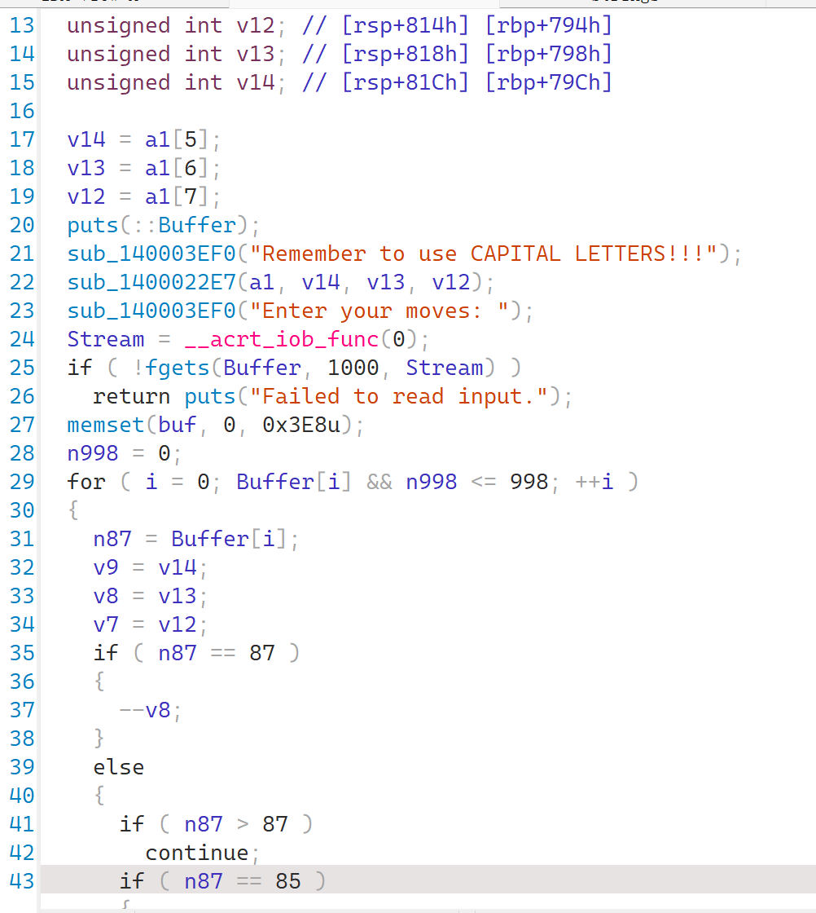
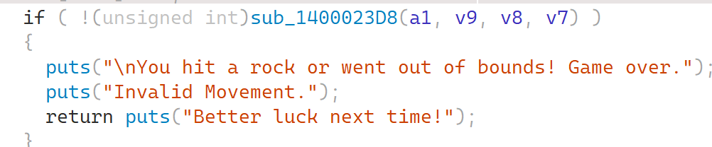
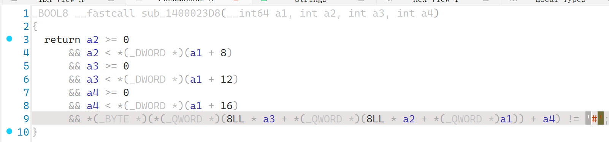
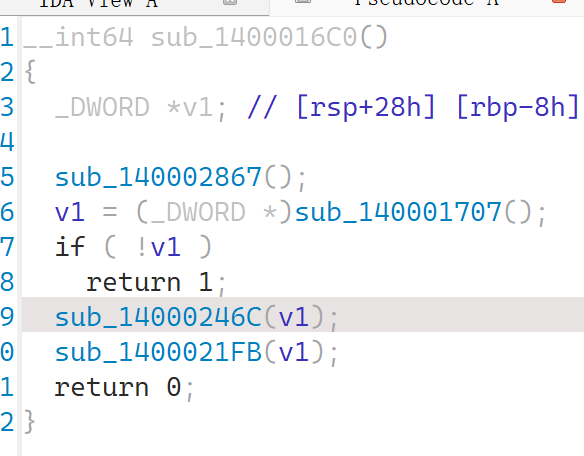

### 星际迷航-归途

#### 题目描述

从离家十万光年处的神秘星球处结束探险，r00t的队长终于即将荣归故乡。只是，通往家乡的旅途充斥着各种星球和星际垃圾，稍不留神就会被威胁查绕，直接死亡。 幸好，onehang队长记得一条md5密令，记载着最短路线。巧妙地爆破出了路线（你猜真的还是假的🐶）之后，队长安全地迅速成功返乡。你可以复刻队长的成功嘛？

#### 解题思路

使用ida打开，我们可以看到字符串中有一堆`#.`内容，怀疑其是迷宫地图，不过先不管他们，进入到主要函数。



将对应87之类的数字转成字符串，得到以下函数

```c
int __fastcall sub_14000246C(_DWORD *a1)
{
  FILE *Stream; // rax
  int v3; // eax
  char buf[1008]; // [rsp+20h] [rbp-60h] BYREF
  char Buffer[1007]; // [rsp+410h] [rbp+390h] BYREF
  char n87; // [rsp+7FFh] [rbp+77Fh]
  unsigned int v7; // [rsp+800h] [rbp+780h]
  unsigned int v8; // [rsp+804h] [rbp+784h]
  unsigned int v9; // [rsp+808h] [rbp+788h]
  int i; // [rsp+80Ch] [rbp+78Ch]
  int n998; // [rsp+810h] [rbp+790h]
  unsigned int v12; // [rsp+814h] [rbp+794h]
  unsigned int v13; // [rsp+818h] [rbp+798h]
  unsigned int v14; // [rsp+81Ch] [rbp+79Ch]

  v14 = a1[5];
  v13 = a1[6];
  v12 = a1[7];
  puts(::Buffer);
  sub_140003EF0("Remember to use CAPITAL LETTERS!!!");
  sub_1400022E7(a1, v14, v13, v12);
  sub_140003EF0("Enter your moves: ");
  Stream = __acrt_iob_func(0);
  if ( !fgets(Buffer, 1000, Stream) )
    return puts("Failed to read input.");
  memset(buf, 0, 0x3E8u);
  n998 = 0;
  for ( i = 0; Buffer[i] && n998 <= 998; ++i )
  {
    n87 = Buffer[i];
    v9 = v14;
    v8 = v13;
    v7 = v12;
    if ( n87 == 'W' )
    {
      --v8;
    }
    else
    {
      if ( n87 > 'W' )
        continue;
      if ( n87 == 'U' )
      {
        ++v9;
      }
      else
      {
        if ( n87 > 'U' )
          continue;
        if ( n87 == 'S' )
        {
          ++v8;
        }
        else
        {
          if ( n87 > 'S' )
            continue;
          if ( n87 == 'N' )
          {
            --v9;
          }
          else
          {
            if ( n87 > 'N' )
              continue;
            if ( n87 == 'A' )
            {
              --v7;
            }
            else
            {
              if ( n87 != 'D' )
                continue;
              ++v7;
            }
          }
        }
      }
    }
    v3 = n998++;
    buf[v3] = n87;
    buf[n998] = 0;
    if ( !(unsigned int)sub_1400023D8(a1, v9, v8, v7) )
    {
      puts("\nYou hit a rock or went out of bounds! Game over.");
      puts("Invalid Movement.");
      return puts("Better luck next time!");
    }
    v14 = v9;
    v13 = v8;
    v12 = v7;
    if ( v9 == a1[8] && v13 == a1[9] && v12 == a1[10] )
    {
      puts("\nCongratulations! You copied hang's success and returned home!!!");
      return sub_140003EF0("Flag is r00t2025{md5(%s)}\n", buf);
    }
  }
  puts("\nYou didn't reach the end. Game over.");
  sub_140003EF0("Your path: %s\n", buf);
  return puts("Better luck next time!");
}
```

注意到除了WASD还有UN，作为迷宫共六个方向，根据太空的题目描述可以基本断定是三维迷宫了。

其中v9和UN相关，v8和WS相关，v7和AD相关。

再发现以下函数为判断是否成功的函数：

判断方式为：

即`#`为墙，否则为陆地，那么我们就观察地图迷宫是什么。

经过判断所加数字，得到了以下的迷宫地图：

```python
list0 = [
    "..#.......",
    ".#########",
    ".#.#######",
    "...##.....",
    "##########",
    "##########",
    "...###...#",
    ".#.##..#.#",
    ".#...#.###",
    "##.###....",
]
list1 = [
    "#.#.#..##.",
    "#.######..",
    "#.....####",
    "#..######.",
    ".##..###.#",
    "########.#",
    ".#.#####.#",
    ".#######.#",
    ".####..#..",
    "..#.######",
]
list2 = [
    "###.#.#.##",
    ".#######.#",
    "#..##.##.#",
    "#######.#.",
    "######..##",
    "###.##..##",
    "#.#...#.##",
    "#.#.#...#.",
    "##...##.#.",
    "##.#...###",
]
list3 = [
    "###.#...##",
    ".##.#.##.#",
    ".##.#.####",
    "....###..#",
    "##.####.#.",
    "##...###..",
    "#..#####.#",
    "########..",
    "##########",
    "#######...",
]
list4 = [
    "#######.##",
    ".######.##",
    "###.###.##",
    "##.####.##",
    "##.####.#.",
    "##.#..#.##",
    "#.###.#.##",
    "#..#.##.##",
    "#..#...###",
    "#.###....#",
]
list5 = [
    "##########",
    ".#######..",
    "###.###.#.",
    ".########.",
    ".#.###....",
    ".#.###.##.",
    "..####.##.",
    ".######..#",
    "...#.#..##",
    "##...###..",
]
```

现在就差起点和终点了。起点在运行文件的时候其实就已经知道了，是（0，0，0）点，而终点判断方式如下：，a1是从外面传进来的，定位到a1：发现是`v1`传进来的，而其又是`sub_140001707()`返回的，也就是生成迷宫地图的函数。于是观看，发现其在最后定义了几个数：，判断这就是定义起点和终点的地方，于是终点便是（0，9，9）。

> 上面这个内容我在写代码时使用的是结构体，如果大概知道了结构体的情况，将其恢复可以极大程度的使代码更加美观。这里我给出我使用的结构体，方便复现：
>
> ```c
> typedef struct
> {
>  char ***grid;    // 三维迷宫网格
>  int levels;      // 层数
>  int rows;        // 每层行数
>  int cols;        // 每层列数
>  int start_level; // 起点层
>  int start_row;   // 起点行
>  int start_col;   // 起点列
>  int end_level;   // 终点层
>  int end_row;     // 终点行
>  int end_col;     // 终点列
> } Maze3D;
> ```

在有了一切信息后，我们可以编写脚本解开路径了：

```python
# 我将起点和终点改成了S和E，更加方便程序逻辑进行编写和判断
list0 = [
    "S.#.......",
    ".#########",
    ".#.#######",
    "...##.....",
    "##########",
    "##########",
    "...###...#",
    ".#.##..#.#",
    ".#...#.###",
    "##.###...E",
]
list1 = [
    "#.#.#..##.",
    "#.######..",
    "#.....####",
    "#..######.",
    ".##..###.#",
    "########.#",
    ".#.#####.#",
    ".#######.#",
    ".####..#..",
    "..#.######",
]
list2 = [
    "###.#.#.##",
    ".#######.#",
    "#..##.##.#",
    "#######.#.",
    "######..##",
    "###.##..##",
    "#.#...#.##",
    "#.#.#...#.",
    "##...##.#.",
    "##.#...###",
]
list3 = [
    "###.#...##",
    ".##.#.##.#",
    ".##.#.####",
    "....###..#",
    "##.####.#.",
    "##...###..",
    "#..#####.#",
    "########..",
    "##########",
    "#######...",
]
list4 = [
    "#######.##",
    ".######.##",
    "###.###.##",
    "##.####.##",
    "##.####.#.",
    "##.#..#.##",
    "#.###.#.##",
    "#..#.##.##",
    "#..#...###",
    "#.###....#",
]
list5 = [
    "##########",
    ".#######..",
    "###.###.#.",
    ".########.",
    ".#.###....",
    ".#.###.##.",
    "..####.##.",
    ".######..#",
    "...#.#..##",
    "##...###..",
]


mazes = [list0, list1, list2, list3, list4, list5]
start:tuple[int, int, int] = (0,0,0)
end:tuple[int, int, int] = (0,0,0)
L = len(mazes)
R = len(mazes[0])
C = len(mazes[0][0])

# 找起点和终点

for l in range(L):
    for r in range(R):
        for c in range(C):
            if mazes[l][r][c] == 'S':
                start = (l, r, c)
            elif mazes[l][r][c] == 'E':
                end = (l, r, c)

# BFS 搜索

queue = deque()
queue.append((start, [start]))
visited = set()
visited.add(start)

directions = [
(0,-1,0,'W'),  # 上
(0,1,0,'S'),   # 下
(0,0,-1,'A'),  # 左
(0,0,1,'D'),   # 右
(1,0,0,'U'),   # 上层
(-1,0,0,'N'),  # 下层
]

found = False
while queue:
    (l,r,c), path = queue.popleft()

    if (l,r,c) == end:
        print("找到最短路径，长度:", len(path)-1)
        # 生成移动序列
        moves = []
        for i in range(1, len(path)):
            cl, cr, cc = path[i-1]
            nl, nr, nc = path[i]
            for dl, dr, dc, move in directions:
                if cl+dl == nl and cr+dr == nr and cc+dc == nc:
                    moves.append(move)
                    break
        print("ASDUN序列:", ''.join(moves))
        found = True
        break

    for dl, dr, dc, _ in directions:
        nl, nr, nc = l+dl, r+dr, c+dc
        if 0 <= nl < L and 0 <= nr < R and 0 <= nc < C:
            if mazes[nl][nr][nc] != '#' and (nl,nr,nc) not in visited:
                visited.add((nl,nr,nc))
                queue.append(((nl,nr,nc), path+[(nl,nr,nc)]))

if not found:
    print("没有找到路径。")

```

于是得到路径`DUSSDDDDUUWWDDUSSSSUDDNNSASSDNSNAWWNAASSSDDD`，进行MD5得到`f0d0c0909b0af5f204a03f78759046af`，所以flag就是`r00t2025{f0d0c0909b0af5f204a03f78759046af}`

这个大小写问题我写的已经不能再清楚了把，再错就不是我的问题了噢。

#### 出题思路

一个新生赛的REV没有一道迷宫题是不完整，至少我是这么觉得的，不过可以在其上进行创新。

我们可以看到去年的比赛使用的迷宫存储方式是二维空间在一维数组中的展开，想当初我还是真按照一维的形式做出来的（<del>我还是有点想象力了</del>）而这次我就采用了三维空间在二位数组中的展开，这可是我纯纯头脑风暴画出来的地图（本来想出四维的，奈何在有限的时间内想不出大小适合的地图）。

并且我通过不提示上下两个方向字符的方式，阻止了啥都不管，光想着纯暴力破解的同学妄图使用wasd跑一晚上直接梭出路径。