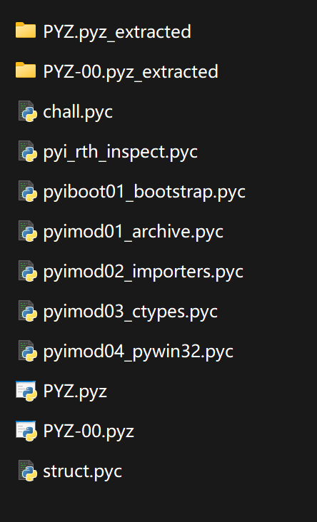

### 派生

#### 题目描述

这是什么图标？怎么这么眼熟？好像在哪里见过？

#### 解题思路

下载exe文件解压缩，发现exe程序是一个眼熟的图标（使用pyinstaller打包默认这个图标，除非特意设置），直接看`_internal`文件夹发现一堆pyd文件，断定是一个python程序（当然你拖入ida发现一堆python的库从而发现也可以）

这时候我们采用将python反编译还原为python的方法（网上很多教程都能告诉你这一点），而不是直接分析python的exe的方法<-这样太难了。

先使用pyinstxtractor.py将其反汇编，会生成一个`文件名_extract`文件夹，在其中找到和你的文件名字相同的文件（通常）即可进行下一步

观察python版本，发现是3.8，是简单模式，可以再使用uncompyle6进行反汇编生成python文件，或者使用在线平台，这一版本的反编译有许多平台可以做到，比如[这个网站](https://rivers.chaitin.cn/tools/pyc2py)。

得到内容：

```python
# Source Generated with Decompyle++
# File: chall.pyc (Python 3.8)

import base64

def transform(data = None):
    ''' 可逆但非线性的变换 '''
    out = bytearray()
    for i, b in enumerate(data):
        b ^= i * 73 & 255
        b = (b << 3 | b >> 5) & 255
        b = b * 197 % 255
        b ^= 165
        out.append(b)
    return bytes(out)

TARGET = b'NXacNFJjatWWeUtHlpeuxK7db6wWnBjFN5odN8ZgGQ8='

def check(flag = None):
    raw = flag.encode()
    t = transform(raw)
    return base64.b64encode(t) == TARGET

if __name__ == '__main__':
    user = input('Input flag: ').strip()
    if check(user):
        print('Correct!')
    else:
        print('Wrong!')

```

这还是比较简单的，和week1在C中使用MT19937那题差不多，写出逆向脚本：

```python
import base64
from Crypto.Util.number import *

def rotr(x, r):
    return ((x >> r) | (x << (8 - r))) & 0xFF

def inverse_transform(data: bytes) -> bytes:
    out = bytearray()
    for i, b in enumerate(data):
        # 逆 XOR 0xA5
        b ^= 0xA5
        
        # 逆乘 197  (mod 256)
        b = (b * inverse(197,0xFF)) % 0xFF
        
        # 逆 rotl 3  = rotr 3
        b = rotr(b, 3)

        # 逆 XOR (i*73)
        b ^= (i * 73) & 0xFF

        out.append(b)
    return bytes(out)

TARGET = b"NXacNFJjatWWeUtHlpeuxK7db6wWnBjFN5odN8ZgGQ8="
print(inverse_transform(base64.b64decode(TARGET)))
```

#### 出题思路

让大家扩展一下思路，exe不止是恒定的C和C++之类，python也可以，不过相对没那么安全。

可以了解一下不同python版本的逆向破解难度，同样是使用pyinstaller打包，版本越新的python越难逆向。