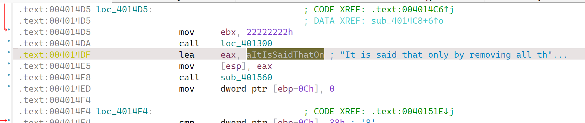
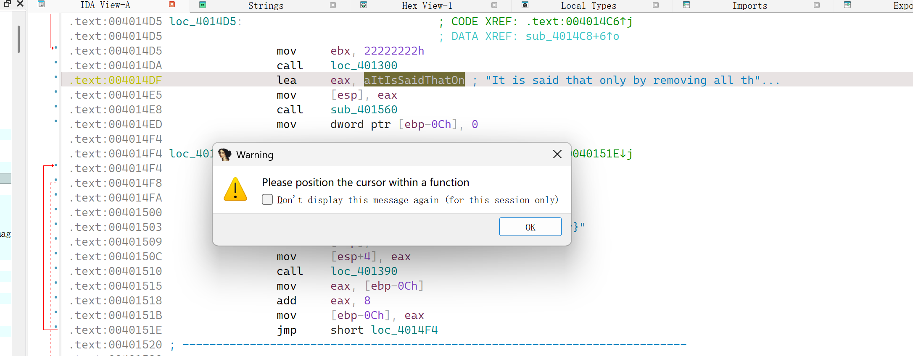
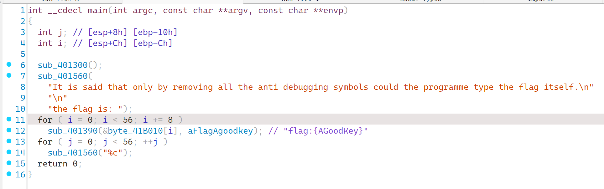
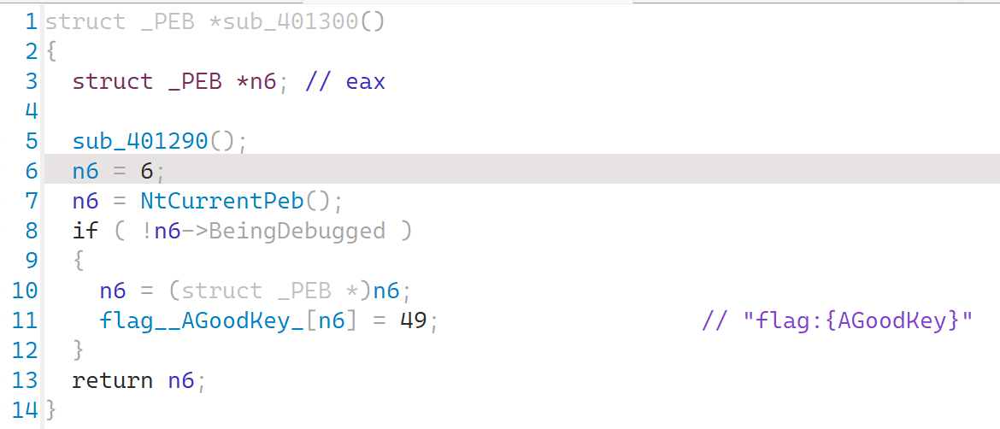
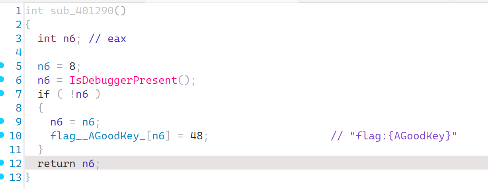

### 调试中-勿扰

#### 题目描述

这是一个非常神奇的程序，在没有被查看的情况下就已经在被调试了，我也不知道是谁在调试。 据说，这个程序在没有被调试的时候会自己把flag输出出来。

#### 解题思路

我们使用ida打开，查找字符串，找到了字符串所在位置：

但是发现，根本没有办法反编译这一块内容：

猜到使用了花指令，然后分析汇编代码（交给ai分析也可以）。

反正经过漫长的手动或者自动分析，我可以告诉你，你会发现从jnz到mov 22222222的区间都是花指令，将这些内容nop掉，程序就可以反编译了（我一共使用了4处），如果直接不行，保存patch后重新打开分析一遍就可以了。



进入程序加密逻辑`sub_401390`查看，发现是一个典型的tea加密函数，只是为什么无法输出正确内容呢？

逐个分析主函数中的函数，上面第一个函数便是关键：

发现这个函数进行了一个反调试，如果检测到程序没有处于被调试状态，则将第六位改成49也就是`1`。

同时，其中还有一个函数`sub_401290`，也是关键：

这个就更加简明了，同样的反调试，将第8位改成48也就是`0`。

于是，真正的密钥就是`flag:{1G0odKey}`，写出解密脚本（其实就是原样照抄）：

```c
#include <stdio.h>
#include <stdint.h>

void teaDecrypt(uint32_t *v, uint32_t *k)
{
    uint32_t sum = 0, v0 = v[0], v1 = v[1];
    uint32_t delta = 0x114514;
    sum = delta * 32;
    for (int i = 0; i < 32; i++)
    {
        v1 -= ((v0 << 4) + k[2]) ^ (v0 + sum) ^ ((v0 >> 5) + k[3]);
        sum -= delta;
        v0 -= ((v1 << 4) + k[0]) ^ (v1 + sum) ^ ((v1 >> 5) + k[1]);
    }
    v[0] = v0;
    v[1] = v1;
}

// unsigned char ans[56] = "r00t2025{stvt1c_d1buggin9_w14_4lowers_to_@ntiDbg_OwO}";
unsigned char ans[56] = {0xe6, 0xe9, 0xd9, 0x6a, 0xcc, 0xb8, 0x48, 0xeb, 0xfa, 0xbb, 0xb5, 0x7, 0x82, 0xd5, 0xb, 0x93, 0x63, 0x12, 0xec, 0xbb, 0xe2, 0x4e, 0x43, 0x19, 0xe6, 0x58, 0x7f, 0xc7, 0xf8, 0xa, 0xf5, 0x6f, 0xa3, 0xfd, 0xf9, 0xb5, 0xcd, 0x42, 0xee, 0x2c, 0x20, 0x5e, 0x5c, 0xd5, 0xdd, 0xdd, 0x7d, 0x20, 0xb0, 0xab, 0x73, 0xb1, 0x5, 0x85, 0x3b, 0x2d};

int main()
{
    char key[16] = "flag:{1G0odKey}";
    for (int i = 0; i < 56; i += 8)
        teaDecrypt((uint32_t *)(ans + i), (uint32_t *)key);
    for (int i = 0; i < 56; i++)
    {
        printf("%c", ans[i]);
    }
    return 0;
}

```

得到flag（在脚本中）

#### 出题思路

这道题完全是想让大家通过静态分析的思路解题，<del>静静分析美丽的花朵</del>，没想到做的时候有人使用了动态调试。动态没做出来是正常的，因为我是手动让这个程序处于被调试的附加状态，是程序运行过程中进行修改的，对于反反调试的手段可以说一概不行，当然如果找到了我这个调试程序添加的位置，手动去除，也是可以的。