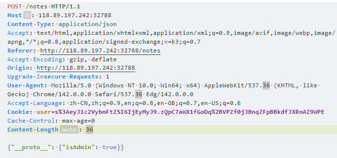
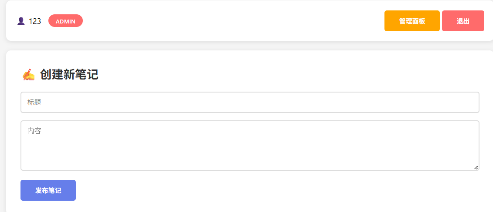

# 笔记系统

进入页面后是一个登陆和注册的窗口

我们注册一个账号发现是一个创建笔记的网页

可以记录标题和内容，记录后的笔记会存放在所有笔记当中

题目还给出了源码

下载下来过后审计源码

在app.js当中可以看到后端代码

注意到用户中初始存在一个admin用户，而密码不知道，但admin具有一个isAdmin: true的属性，那么我们可以思考，是否能让普通用户的这个属性也为true从而获得admin的权限呢

```
const users = {
    'admin': {
        username: 'admin',
        password: 'fake_passwd',
        isAdmin: true
    }
};
```

继续查看后续代码

```
app.post('/login', (req, res) => {
    const { username, password } = req.body;
    const user = users[username];
    
    if (user && user.password === password) {
        const userData = { username: user.username };
        if (user.hasOwnProperty('isAdmin')) {
            userData.isAdmin = user.isAdmin;
        }
        const cookie = Buffer.from(JSON.stringify(userData)).toString('base64');
        res.cookie('user', cookie, { signed: true });
        res.redirect('/notes');
    } else {
        res.send('用户名或密码错误！<a href="/login">重试</a> | <a href="/register">注册</a>');
    }
});
```

在登陆时，没有isAdmin这个属性的用户是不会自动添加这个属性的，所以我们只能通过某种方法让普通用户也具有这个属性

在代码开头有这样一个函数

```
function merge(target, source) {
    for (let key in source) {
        if (typeof source[key] === 'object' && source[key] !== null) {
            if (!target[key]) {
                target[key] = {};
            }
            merge(target[key], source[key]);
        } else {
            target[key] = source[key];
        }
    }
    return target;
}
```

如果了解过js原型链污染（不知道的同学先学习一下js原型链污染）就可以知道这是一个很明显的危险函数，因为它可以将source的`__proto__`属性添加到target中，如果我们把`Object.prototype`的isAdmin修改为true，那么他的所有子类都会具有isAdmin属性，所以现在我们来找一下代码中哪里调用了这个函数

```
app.post('/notes', (req, res) => {
    const note = {};
    merge(note, req.body);
    notes.push(note);
    res.redirect('/notes');
});
```

发现在写笔记时会自动调用这个函数，所以我们可以利用笔记功能抓包传输json数据

 ```
 {"__proto__": {"isAdmin": true}}
 ```


使得原型链被污染从而使我们的用户获得admin权限然后得到flag

注意将**Content-Type**改为 **application/json**



再次刷新页面就可以发现我们具有了admin权限



# 